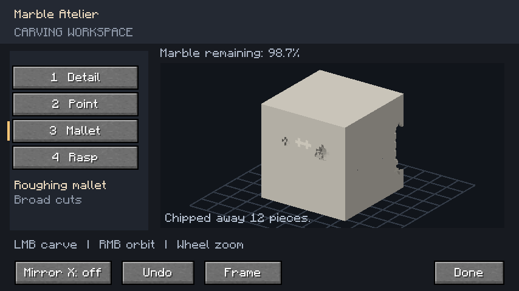

# HobbyMod

A Minecraft **1.21.1 / NeoForge** mod combining marble sculpture, astronomy,
vineries, painting, cameras, woodworking, and other creative hobbies.

## Marble sculpting

Craft four marble blocks from two calcite and two quartz in a checkerboard.
Place one and right-click with any carving tool to open **Marble Atelier**, an
orbiting 3D workspace. Opening the editor preserves the entire marble blank;
every cut you make changes your own sculpture rather than selecting a preset.
You can also make an editable blank in a stonecutter.



| Tool | Effect | Crafting ingredients |
| --- | --- | --- |
| Detail chisel | Remove one tiny piece | Iron ingot above a stick |
| Point chisel | Cut a small group of pieces | Iron nugget, iron ingot, stick vertically |
| Roughing mallet | Make broader cuts | Three iron ingots across the top, two sticks down the middle |
| Polishing rasp | Finish exposed surfaces without removing marble | Two iron ingots vertically above a stick |

Keep the tools you want to use in your inventory. Successful strokes wear tools
in survival; creative preserves durability. The creative tab includes all tools
and a blank.

| Input | Action |
| --- | --- |
| Left click / drag | Chip or polish the surface under the cursor |
| Right / middle drag, or Alt + left drag | Orbit around the sculpture |
| Shift + orbit drag | Pan the view |
| Mouse wheel | Zoom |
| 1–4 | Select a tool |
| Mirror X | Apply cuts to both sides |
| Ctrl + Z / Undo | Restore your most recent stroke (up to 12) |
| F / Frame | Reset the view |
| Escape / Done | Return to the world |

Your work appears in the world immediately and saves with the block. Mining
with a pickaxe preserves its design in the dropped item and when placed again.
Undo history lasts only while that block entity remains loaded, and you can undo
only your own most recent stroke; undo does not refund tool durability. Multiplayer
editing is validated and synchronized by the server.

Carving uses a **32 × 32 × 32** volume (32,768 pieces per block), with cached,
merged surface meshes. This is detailed voxel carving: curved forms have tiny
steps, and the rasp changes their finish rather than generating a smooth mesh.
Collision uses a coarser 8 × 8 × 8 approximation for performance. Existing preset
statues remain compatible with saved worlds, but new carving starts with a blank.
The first world models reuse vanilla calcite, quartz, iron, and wood textures.
Natural marble deposits and other hobbies, including astronomy, are future work.

## Development

For Jacob's local Windows checkout and GitHub synchronization, see
[Windows setup](tools/windows/README.md). Other Windows accounts must skip local
setup; cloud work remains available. This restriction is also recorded in
`AGENTS.md` for future Codex tasks.

Install a **Java 21 JDK** (a runtime alone is insufficient), then use the included
Gradle wrapper from the repository root:

In this prepared Codex cloud environment, first run
`source /workspace/.hobbymod-tools/activate.sh` to select the JDK and configure
Java's network proxy and trusted system certificates.

```sh
./gradlew build
./gradlew :neoforge:runClient
./gradlew :neoforge:runServer
```

The NeoForge development launcher starts a headless server in development mode.
A client requires a graphical display. Headless cloud tasks should build first
and use the development server for functional validation. A standalone production
server requires accepting Minecraft's EULA; read https://aka.ms/MinecraftEULA
before setting `eula=true` in that server's local file.
Look for `HobbyMod initialized on NeoForge` and the server's `Done` message.
Generated worlds, logs, and EULA files stay in ignored run directories.
The development server uses `neoforge/run/server.properties`; this cloud instance
binds it to `127.0.0.1`. Use an interactive terminal and enter `stop` to shut down.
Architectury's development transformer currently leaves worker threads alive
after Minecraft stops. Once the log reports `All dimensions are saved`, terminate
the remaining Java process running `dev.architectury.transformer.TransformerRuntime`
that belongs to that launch (SIGTERM), then exit Gradle if needed. Ctrl+C alone
can leave that child process behind. This affects the development launcher,
not the mod's initialization or release jar.

Distribute `neoforge/build/libs/hobbymod-neoforge-0.1.0.jar`, together with the
Minecraft 1.21.1 NeoForge edition of **Architectury API 13.0.8**. The `dev` and
`dev-shadow` jars are development artifacts, not installable releases.
No credentials are required to resolve public dependencies.

## Portable design

- `common`: gameplay, assets, data, and Architectury API usage.
- `neoforge`: NeoForge entry point and any platform-specific integrations.

Prefer Architectury's registry, event, and networking abstractions in shared
code. Keep client-only rendering separate from dedicated-server initialization.
Add feature packages under the common namespace as each hobby is developed;
keep stable IDs under `hobbymod` and group assets/data by feature.

A future Fabric port should add a Fabric module and entry point calling
`HobbyMod.init()`, a Fabric Architectury runtime dependency, Fabric metadata,
and `fabric` to the common platform list. Cross-version ports still need updates
to Minecraft APIs, mappings, dependencies, and data formats. Architectury does
not make those changes automatic.

Minecraft, NeoForge, Architectury API, and Gradle versions are centralized in
`gradle.properties` and the wrapper. The Architectury and Loom build plugins
use concrete versions rather than snapshot versions.

## Tests

Run `./gradlew --no-daemon :common:test` for six geometry and camera tests covering
ray picking through carved space, tools, serialization, mesh winding, malformed
data, and orbit transforms.

Run `./gradlew --no-daemon -Pgametest :neoforge:runServer` in an interactive
terminal. Once the server is ready, enter `test runall`. Eight GameTests cover
opening an untouched blank, survival tools and symmetry, creative and polish,
stale revisions and undo ownership, persistence and update tags, mining and
replacement, invalid targets and broken tools, and unrelated stone. Check for
eight distinct `SCULPTING_TEST_PASS` entries in the server log (the vanilla
summary goes to in-game players). Then shut down as described above. Tests use
the ignored development world; use a disposable world when running them.

GameTests and their structure template live in `neoforge/src/gametest` and are
included only with `-Pgametest`. Run a normal `./gradlew build` to produce the
release jar without GameTest classes or test structures. Gradle's ordinary
`test` task runs the shared unit tests, but not the in-game integration tests.
Visual client play-testing remains separate from the dedicated-server tests.
