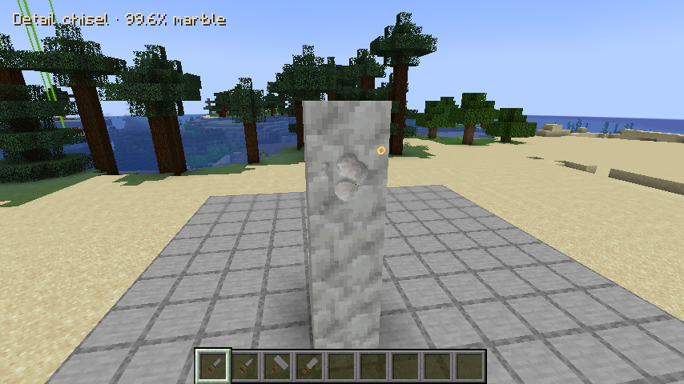

# HobbyMod

A Minecraft **1.21.1 / NeoForge** mod combining marble sculpture, astronomy,
vineries, painting, cameras, woodworking, and other creative hobbies.

## Marble sculpting

Craft four marble blocks from two calcite and two quartz in a checkerboard.
Place marble and right-click with a carving tool to orbit around **the actual
sculpture in the world**. The world, nearby blocks, lighting, and your hotbar
stay visible. Opening carving mode preserves the entire blank. A stonecutter
can also produce a blank. Stack marble vertically to make one taller carving
surface. Opening it joins the stack; adding marble to an existing sculpture
joins the new section automatically. Shift + wheel moves the camera up or down.
The overlay shows only your held tool and the percentage of marble remaining
in the pillar. Controls and tool instructions belong in the planned hobbies
guidebook.



Select tools normally from your hotbar or open your inventory. The server uses
the tool actually held in your main hand (or offhand if your main hand has no
carving tool); there is no separate tool palette.

| Tool | Effect | Crafting ingredients |
| --- | --- | --- |
| Detail chisel | Small curved recesses | Iron ingot above a stick |
| Point chisel | Medium curved cuts | Iron nugget, iron ingot, stick vertically |
| Roughing mallet | Broad rounded cuts | Three iron ingots across the top, two sticks down the middle |
| Polishing rasp | Smooth high spots and polish the surface | Two iron ingots vertically above a stick |

Successful strokes wear tools in survival; creative preserves durability. The
creative tab includes all tools and a blank. Carving mode does not pause the
world or move your player; damage, distance, or removal of the block ends it.
The camera stops at surrounding blocks so you cannot orbit through walls.

| Input | Action |
| --- | --- |
| Left click / hold and drag | Cut or smooth a continuous stroke under the brush |
| Right / middle drag, or Alt + left drag | Orbit around the placed sculpture |
| Ctrl + mouse wheel | Zoom |
| Shift + mouse wheel | Move up/down the marble pillar |
| 1–9 / mouse wheel | Select your hotbar slot |
| E | Open the real inventory, then return to carving |
| M | Toggle X symmetry |
| F | Reset the camera |
| Escape | Leave carving mode |

Cuts modify a signed-distance field. An interpolated surface mesh and smooth
normals give curved cuts instead of tiny cube faces. The rasp erodes high spots
rather than adding marble. Brush picking intersects the same triangles that
are rendered. Geometry still has finite resolution (32 samples per block,
with sub-grid interpolation); very thin details below that resolution cannot
be preserved. Collision remains a coarser 8 × 8 × 8 approximation.

Cuts and rasp strokes cross vertical block boundaries. Drag strokes interpolate
short cursor movements, with one durability charge per accepted update rather
than per interpolated brush sample. Large jumps start a separate cut. Carving
produces two small dust particles to keep the work visible.

After every stroke, disconnected fragments break away as debris. Only one
connected component rooted in the lowest surviving marble remains, so severed
arms or tops cannot float. Connectivity is checked across the whole pillar, including neighboring sections.
A severed upper section disappears; removing stone is permanent.
Previously saved voxel sculptures migrate into smooth geometry, retaining
their shape approximately; disconnected fragments are removed. Existing legacy
preset statue IDs remain compatible with saved worlds.

Work appears immediately and saves with the block. Mining with a pickaxe
preserves each section’s design when picked up and placed again. There is no
undo. Multiplayer edits are validated and synchronized by the server.
You must remain within six blocks of the section you carve; moving the camera
does not move your player or extend their reach.

The models reuse vanilla calcite, quartz, iron, and wood textures. Natural
marble deposits and astronomy are future work.

## Marble blueprints

Capture and reapply carved marble structures, and share them as `.marble.json` files.
See [blueprint capture, application, and file controls](docs/MARBLE_BLUEPRINTS.md).

## Pottery

Throw smooth, hollow pots on a visibly spinning wheel in the world. Shape the
profile with your hands, smooth it with a rib or sponge, trim leather-hard clay,
cut it off, dry it, bisque-fire it, glaze it in any of sixteen colors, and fire
it again. Every step preserves your own design. Finished pots can hold flowers rendered with world models; empty hands remove them.
Place pots at the clicked point on a block. Kilns use a furnace-style inventory
with input, fuel, progress, cooling, and output slots.

See [the full pottery process and controls](docs/POTTERY.md). All pottery blocks,
tools, clay, and glazes are available in the **HobbyMod: Pottery** creative tab.

## Development

For Jacob's local Windows checkout and GitHub synchronization, see
[Windows setup](tools/windows/README.md). Other Windows accounts must skip local
setup; cloud work remains available. This restriction is also recorded in
`AGENTS.md` for future Codex tasks.

Install a **Java 21 JDK** (a runtime alone is insufficient), then use the included
Gradle wrapper from the repository root:

In this prepared Codex cloud environment, first run
`source /workspace/.hobbymod-tools/activate.sh` to select the JDK and configure
Java's network proxy and trusted system certificates.

```sh
./gradlew build
./gradlew :neoforge:runClient
./gradlew :neoforge:runServer
```

The NeoForge development launcher starts a headless server in development mode.
A client requires a graphical display. Headless cloud tasks should build first
and use the development server for functional validation. A standalone production
server requires accepting Minecraft's EULA; read https://aka.ms/MinecraftEULA
before setting `eula=true` in that server's local file.
Look for `HobbyMod initialized on NeoForge` and the server's `Done` message.
Generated worlds, logs, and EULA files stay in ignored run directories.
The development server uses `neoforge/run/server.properties`; this cloud instance
binds it to `127.0.0.1`. Use an interactive terminal and enter `stop` to shut down.
Architectury's development transformer currently leaves worker threads alive
after Minecraft stops. Once the log reports `All dimensions are saved`, terminate
the remaining Java process running `dev.architectury.transformer.TransformerRuntime`
that belongs to that launch (SIGTERM), then exit Gradle if needed. Ctrl+C alone
can leave that child process behind. This affects the development launcher,
not the mod's initialization or release jar.

Distribute `neoforge/build/libs/hobbymod-neoforge-0.1.0.jar`, together with the
Minecraft 1.21.1 NeoForge edition of **Architectury API 13.0.8**. The `dev` and
`dev-shadow` jars are development artifacts, not installable releases.
No credentials are required to resolve public dependencies.

## Portable design

- `common`: gameplay, assets, data, and Architectury API usage.
- `neoforge`: NeoForge entry point and any platform-specific integrations.

Prefer Architectury's registry, event, and networking abstractions in shared
code. Keep client-only rendering separate from dedicated-server initialization.
Add feature packages under the common namespace as each hobby is developed;
keep stable IDs under `hobbymod` and group assets/data by feature.

A future Fabric port should add a Fabric module and entry point calling
`HobbyMod.init()`, a Fabric Architectury runtime dependency, Fabric metadata,
and `fabric` to the common platform list. Cross-version ports still need updates
to Minecraft APIs, mappings, dependencies, and data formats. Architectury does
not make those changes automatic.

Minecraft, NeoForge, Architectury API, and Gradle versions are centralized in
`gradle.properties` and the wrapper. The Architectury and Loom build plugins
use concrete versions rather than snapshot versions.

## Tests

Run `./gradlew --no-daemon :common:test` for twenty-three tests: thirteen sculpting geometry tests, seven pottery geometry/process tests, and three blueprint serialization/validation tests. Sculpting checks cover curved
sub-grid cuts and exact mesh picking, tool sizes and subtractive smoothing, overlapping mirrored cuts,
serialization, malformed coordinates/data, closed meshes and winding,
detached-island removal, severing a narrow connection, legacy migration, closed pillar seams, cross-section connectivity, seam brushes, and connections supported through another section.

Run `./gradlew --no-daemon -Pgametest :neoforge:runServer` in an interactive
terminal. After readiness, enter `test runall`. Fourteen GameTests cover opening a
blank, survival and symmetry, creative and smoothing, stale revisions and permanent cuts, persistence and update tags, mining and replacement, invalid
coordinates and tool breakage, held-tool selection, severed fragments, unrelated stone, cuts across stacked blocks, interpolated drag strokes, automatic joining of placed marble, and a severed pillar.
Nine additional pottery GameTests cover the full crafting process, pickup, fuel, cooling, glazing, and persistence.
Verify fourteen distinct `SCULPTING_TEST_PASS`, nine `POTTERY_TEST_PASS`, and two `BLUEPRINT_TEST_PASS` entries in the server log; the vanilla
summary goes to in-game players. Use a disposable world and stop as described
above. Do not rebuild without `-Pgametest` while these tests are starting: that
removes test classes from the development output. If also launching a client,
use `-Pgametest` for both launches until the tests complete.

GameTests and their structure template live in `neoforge/src/gametest` and are
included only with `-Pgametest`. A normal `./gradlew build` produces a release jar
without test classes, structures, or JUnit. Visual client play-testing remains
separate from dedicated-server tests.
