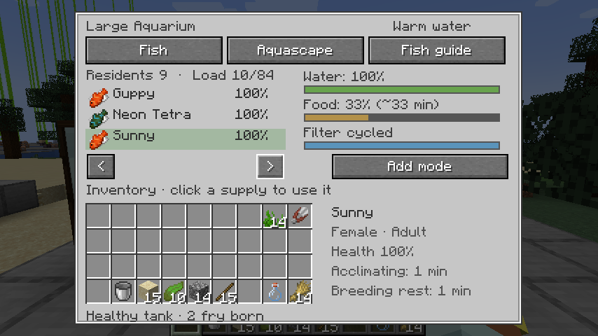
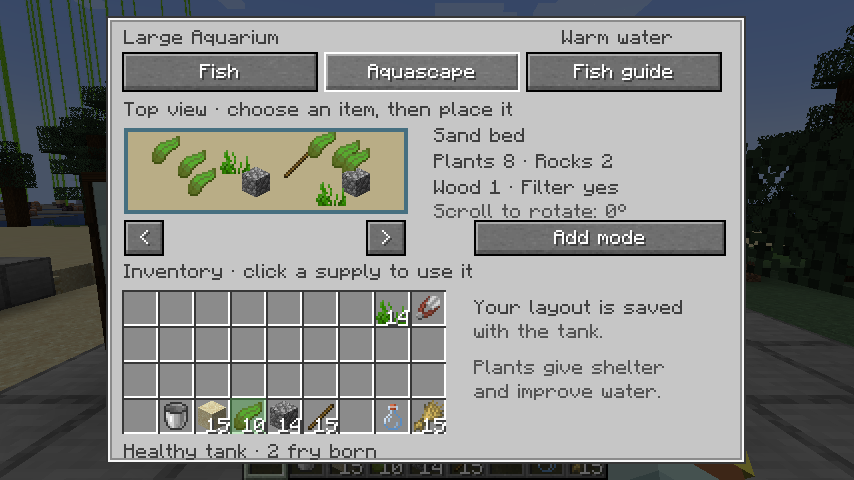
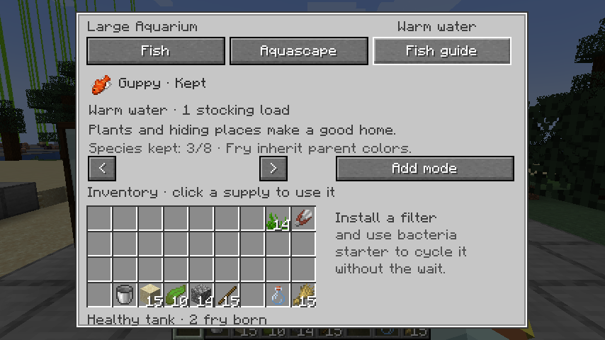
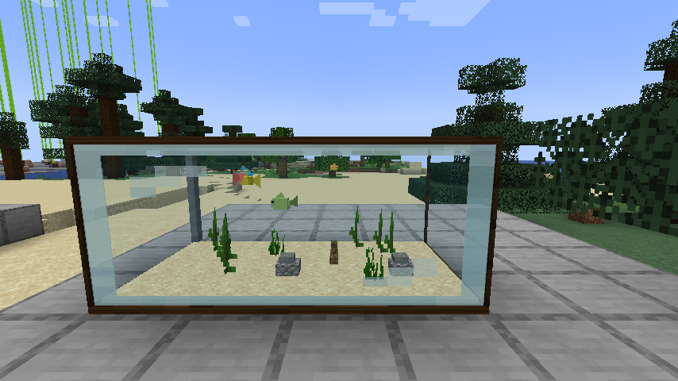
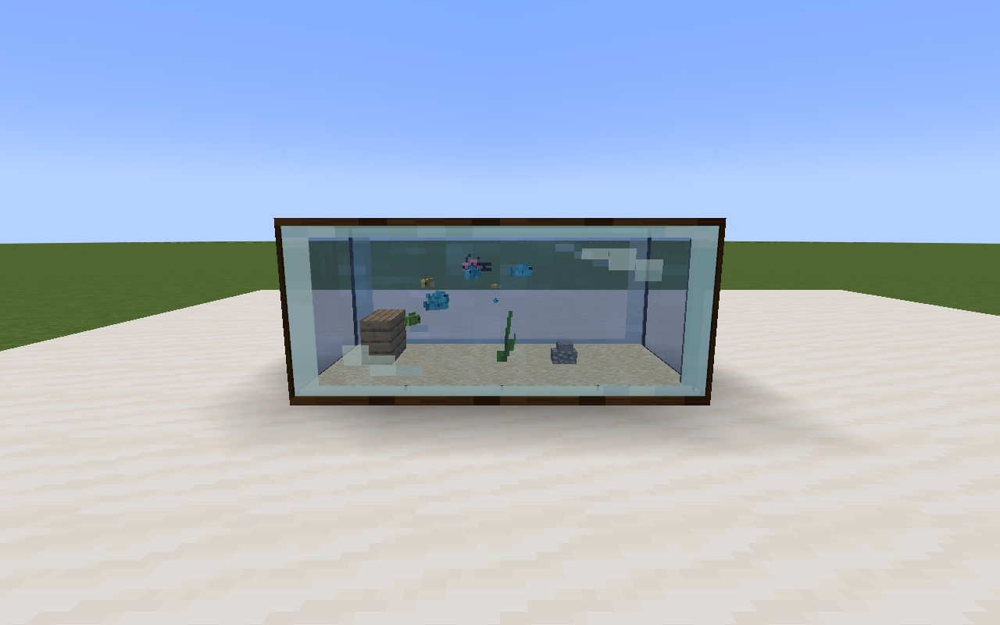
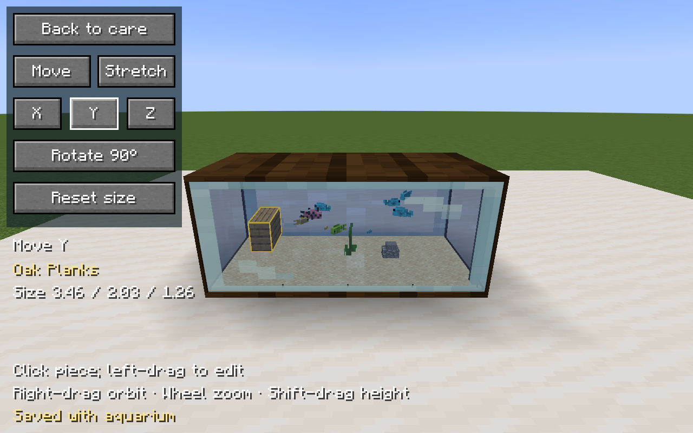
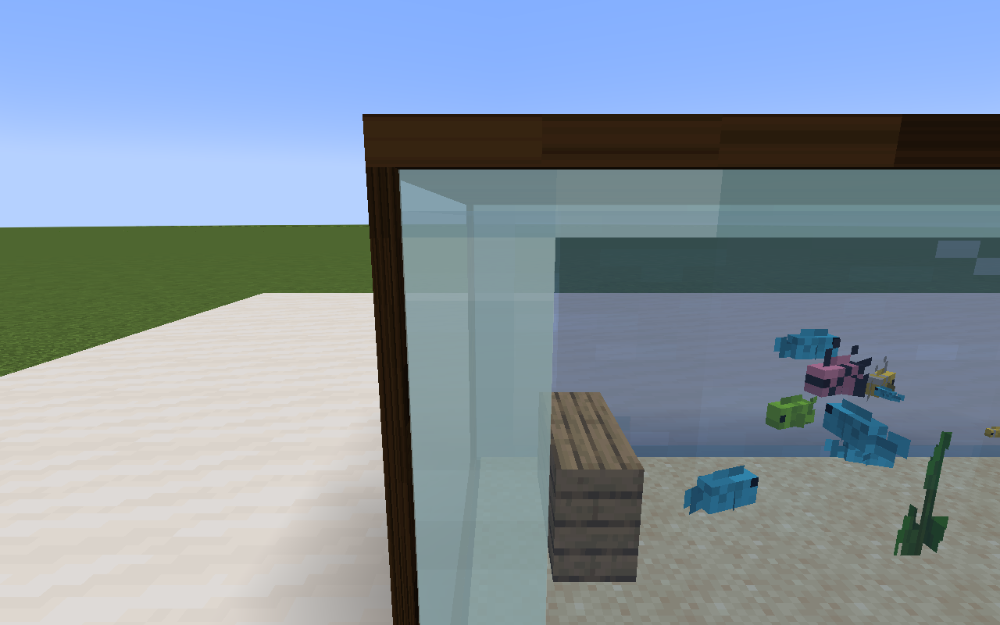

# Aquarium keeping

Craft an aquarium with eight glass around an iron ingot (small), iron block
(medium), or diamond (large). These are custom furniture models with contained
water, glass panels and dark trim. They do not construct vanilla glass walls or
place water in the world.

| Aquarium | Footprint | Height | Stocking capacity |
| --- | --- | --- | --- |
| Small | 1 × 1 | 1 block | 12 load |
| Medium | 2 × 1 | 1 block | 30 load |
| Large | 4 × 2 | 2 blocks | 32 residents / 84 load |

Placement extends along positive X/Z from the clicked corner and reserves only
these cells. Occupied space, entities, world borders and unloaded chunks are
checked before consuming the item. The extra cells are aquarium parts rather
than independent glass blocks. Right-click **any part** to open its screen.

## Keeping your aquarium

Right-click any part of the tank. The screen uses a crisp Minecraft inventory
panel, native item icons, tooltips and buttons; it never blurs the panel. Your
inventory is shown as supply slots: click an item to use it, rather than move it
between inventories. Server checks consume the real item only when it succeeds.

**Fish** shows your residents, water, food and cycling. Select a resident to see
its health, sex, age and acclimation; use a bucket to move it or a renamed name
tag to give it a name. Supply tooltips explain refusals before adding fish.
Residents are identified by UUID when actions reach the server, so another
player moving a fish does not make your action capture the wrong resident.

**Aquascape** lets you build your own habitat. Add sand or gravel, select
seagrass, kelp, cobblestone, a stick or another block in your inventory, then click the top view
to place it. Scroll to choose 0°, 90°, 180° or 270° rotation. Toggle
**Add mode / Remove mode** and click a decoration to recover its exact original material.
Layout, plant types, substrate type and rotations survive chunk reloads and
carrying the tank. **Edit in 3D** opens an orbit camera: click a piece, left-drag
to move it, or select Stretch and X/Y/Z to change its size independently.
Select Y or hold Shift while moving to lift a piece. Right-drag to orbit and
scroll to zoom. Rotate turns the selected piece 90°; Reset size restores its
original proportions. Edits are constrained to the tank interior and saved on
release. Each decoration has its own persistent identity, so another player
removing a different piece cannot redirect your edit.

Kelp and seagrass differ in height. Driftwood has branches;
rocks stack into small formations. Plants sway in the water.

**Fish guide** explains all eight species, water temperatures, stocking loads,
schooling and incompatibilities. The journal remembers species introduced to
this tank even after they move elsewhere. Healthy adult pairs produce fry with
inherited colors; your tank records how many fry have been born. Hover a fish
for acclimation and habitat advice. Schooling advice is helpful, not an extra
punishment for keeping fewer than three.

1. Fill the aquarium with a water bucket.
2. Lay sand or gravel and arrange plants, rocks and driftwood.
3. Install an aquarium filter. Craft **Filter Bacteria Starter** from moss,
   bone meal and a glass bottle, then use it to establish a cycled filter
   immediately. The bottle is returned. Natural cycling still takes five loaded
   minutes if you prefer to wait; an already-cycled filter refuses extra starter.
4. Choose compatible fish and give them two minutes to acclimate.
5. Feed, watch, name, breed and rearrange your aquarium. Food pellets appear and
   the fish gather near the surface when feeding. Filter bubbles and planted
   shelter make the enclosure feel alive.

| Supply | Action |
| --- | --- |
| Water bucket | Fill / change water: quality +25, algae −15 |
| Fish bag / captured fish | Add that fish; captured fish return their empty bucket |
| Empty bucket | Take selected fish; in remove mode drain an unoccupied tank |
| Fish Food | Reserve +20; excess feeding at 80% or above lowers quality |
| Shears | Clean glass: algae −30, quality +10; uses durability |
| Sand / gravel | Lay substrate; remove mode returns the same kind |
| Seagrass / kelp, cobblestone / stick, other blocks | Select and place in Aquascape; move/stretch in 3D |
| Aquarium Filter | Install filter; remove mode returns it |
| Filter Bacteria Starter | Cycle a filled, installed filter; returns glass bottle |
| Magma cream / snowball | Set warm / cool water |
| Renamed name tag | Name selected fish |

Move residents into buckets before draining; the care screen refuses to drain
a stocked aquarium. Water changes are safe with residents inside.

Food is crafted from wheat and dried kelp (eight portions). The filter recipe
uses three iron ingots, charcoal and redstone. Starter fish bags use paper, a
vanilla raw fish and dye:

| Fish | Raw fish + dye | Water | Stocking load |
| --- | --- | --- | --- |
| Guppy | Tropical fish + orange | Warm | 1 |
| Neon tetra | Tropical fish + light blue | Warm | 1 |
| Zebra danio | Cod + white | Cool | 1 |
| Goldfish | Salmon + orange | Cool | 3 |
| Corydoras | Tropical fish + brown | Warm | 2 |
| Betta | Tropical fish + purple | Warm | 2 |
| Angelfish | Tropical fish + gray | Warm | 3 |
| Cherry barb | Tropical fish + red | Warm | 1 |

Two male bettas, bettas with guppies, and angelfish with neon tetras are
incompatible. Each addition checks temperature, cycling, quality, capacity and
compatibility. New fish acclimate for two minutes.

## Care, breeding and carrying

Chemistry advances once per 1,200 consecutive loaded ticks. Chunk unloading
pauses the clock; time discontinuities do not trigger offline catch-up. Plants
and filters offset stocking/feeding waste. Bright tanks accumulate algae.
Food is shared by all residents. One portion lasts about twenty minutes for a
community of up to twelve stocking load. Larger tanks use one reserve point per
twelve load per minute. The screen estimates the minutes of food remaining.

Poor water, no food, incompatible fish, wrong temperature, drainage or excessive
stocking cause 8 health loss per minute. Healthy conditions restore 4. Fish are
never silently deleted at zero health. Healthy, fed, acclimated adult pairs of
the same species breed at quality 75% or above, with a six-minute cooldown and
at most four fry per update. Fry inherit color/form alleles and parent IDs,
and mature over eight minutes. Stocking and compatibility limits also apply
to offspring.

Breaking any aquarium part dismantles its loaded companion parts and drops one
kit with the complete tank state. Placing it restores its size, contained water,
care, decorations and individual residents. Neighboring unrelated blocks are
preserved. No chunks are force-loaded for dismantling; orphan parts across an
unloaded boundary may need manual removal.

Older glass-multiblock saves retain resident data in their controller. Mine and
replace the controller to rebuild it as compact furniture; remove the old
vanilla glass/water manually. The new code deliberately does not erase old
surrounding builds during conversion.

## Rendering and development

The renderer uses dark oak trim, Minecraft glass and a light contained-water
surface and blue-green tint. Fish use Minecraft’s native tropical-fish and cod
models, textures, markings and tail animations. Cached client-only visual
proxies never enter the world or run entity AI. Their physical size stays
consistent when moved into a larger tank. Individually seeded, smooth waypoint
paths vary direction, speed and height; corydoras swim near the substrate. Feeding
attracts residents to the surface and shows pellets. Filters produce bubbles.
Fish are saved residents, with bounded animation rather than independent entity
AI. NeoForge receives bounds for the entire tank footprint from its renderer,
so the model remains visible when the origin cell leaves the camera frustum.
Geometry simplifies past 24 blocks and renders within 48 blocks. All layout
and care actions validate actual inventory items and player permissions.

Fintastic's public source was reviewed during the initial implementation;
no code or assets were copied. There is no GeckoLib or Create dependency.

Standalone Java 21 checks live in `tests/aquarium/AquariumChecks.java`. They cover
1,000 breeding tanks, 32,000 residents and 307,200 swim poses, as well as cycling,
care, compatibility, genetics, caps, footprint sizes and unloading clocks.
Compile AquariumData, AquariumScape, AquariumClock, AquariumMotion and AquariumChecks, then
run `java AquariumChecks` with their output directory on the classpath.

Eight Minecraft GameTests in `neoforge/src/gametest` cover contained fill/drain,
compact placement with no world water, part routing/dismantling, occupied-space
preservation, persistence/captured fish, exact aquascape item returns, starter
consumption, feeding, occupied-tank drain protection, full model bounds and
transformed block-decoration persistence in update tags and carried kits. Run with
`./gradlew --no-daemon -Pgametest :neoforge:runServer`, then `test runall`;
follow README server shutdown instructions. Development tests stay outside normal
release jars.

The shared unit suite also covers item-backed layout limits, malformed positions,
care pacing, filter starter requirements, legacy conversion and NBT layout saves.
Run `./gradlew --no-daemon :common:test`, then a normal release `build`.

## Verified aquarium overhaul

The NeoForge client was play-tested at 854 × 480 and 1280 × 720, with GUI scales
2 and 3. Checks included filling, sand, filter and bacteria starter, compatible
fish additions, planting at chosen positions, rotating driftwood, removing kelp
and recovering it, feeding pellets and surface reactions, acclimation, natural
breeding, naming a fish and moving it into and out of a bucket without losing
its name, and reconnecting with the saved layout. All 27 shared unit tests and
32 server GameTests passed. The standalone aquarium simulation checks passed
as well. Audio was unavailable in the cloud graphical session.

## Native fish and 3D editor verification

The updated client was launched under Xvfb with Java 21 and Mesa llvmpipe.
Screenshots were captured and opened for inspection at 1280 × 800 (GUI scale 3)
and 854 × 480 (GUI scale 2). Gameplay checks included real inventory-backed
placement of rock, kelp and oak planks; moving, rotating, stretching each axis
and lifting a decoration; reopening the editor; saving and reloading the tank;
and naturally born fry. Water, native fish colors and transparency were checked
from front, side and rear. A close-up with the origin block outside the viewport
reproduced the disappearance, then passed after the NeoForge renderer bounds fix.

All 30 shared tests and all 33 server GameTests passed (eight aquarium tests).
The normal release build passed. Audio was unavailable in this cloud session.

