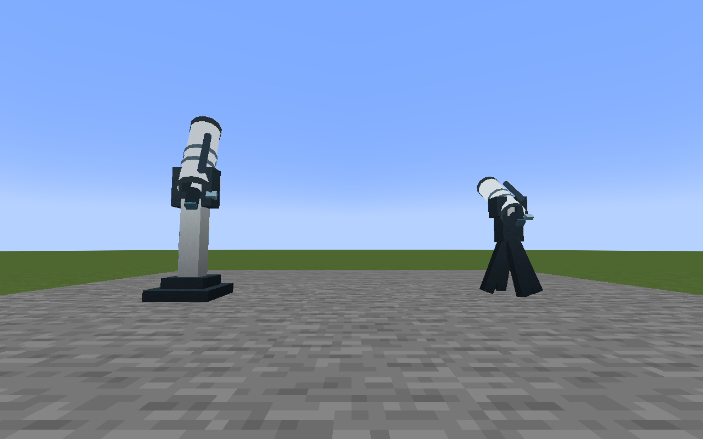
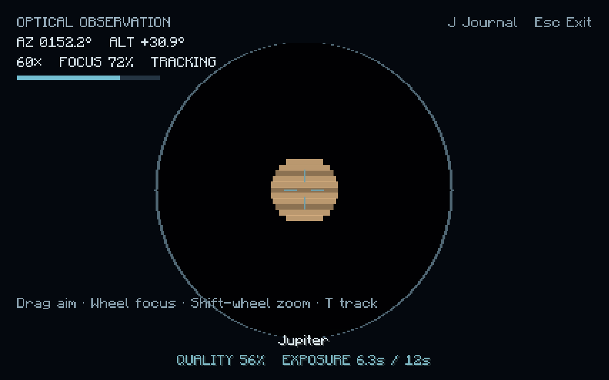
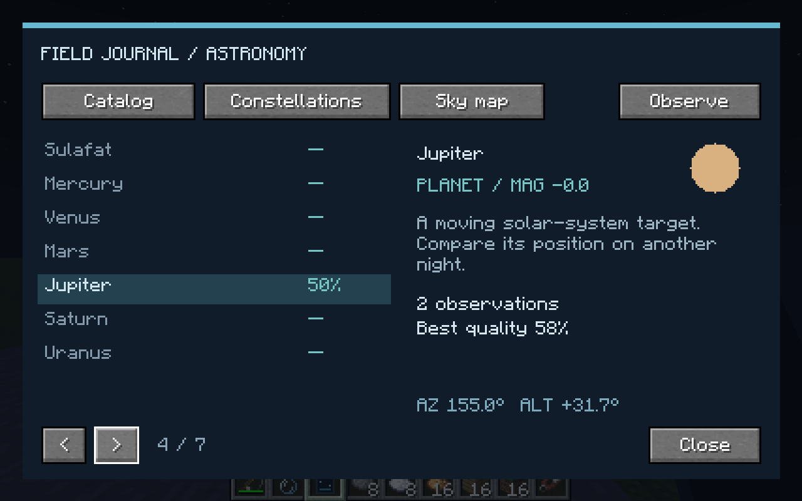
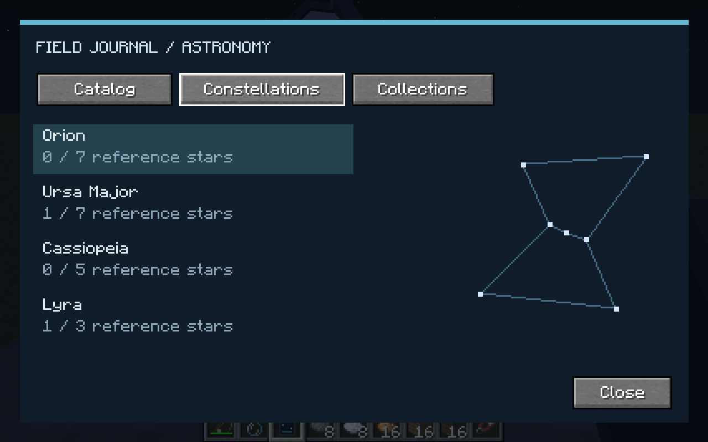
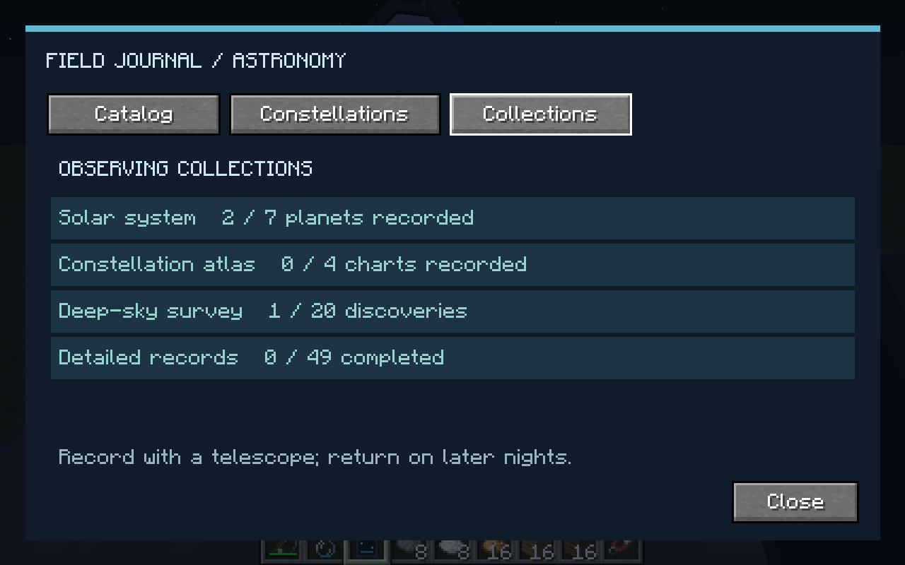
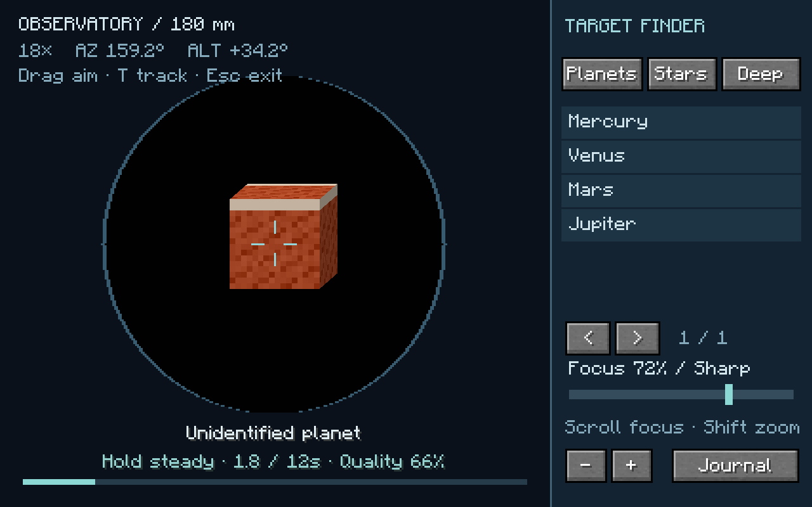
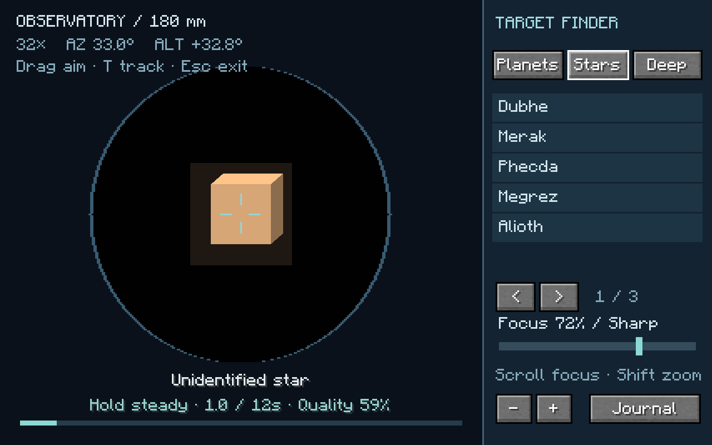

# Astronomy

Astronomy is an observation hobby in **HobbyMod: Astronomy**. It combines four
recognizable constellation patterns, seven planets with simplified orbits, and
twenty deep-sky targets generated from a persistent world astronomy seed.
The equipment uses a modern Minecraft style and a digital field journal.

## Equipment and controls

| Equipment | Use |
| --- | --- |
| Astronomy Field Journal | Right-click while looking away from a block to read the catalog, constellation charts and collection goals. Carry it to record telescope or spyglass observations. |
| Vanilla spyglass | Observe bright stars and planets normally while carrying the journal. |
| Tripod Telescope | 80 mm aperture, 6–40× magnification. Place on a platform with a free block above it. |
| Observatory Telescope | 180 mm aperture, 12–100× magnification and target tracking. Leave two free blocks above it for the tube's full movement arc. |

Recipe-book entries unlock from paper, a spyglass and a tripod telescope,
respectively. The journal uses paper, iron nuggets, glass and redstone. The
tripod telescope uses a spyglass, iron/copper ingots and sticks; the larger
instrument uses a telescope, iron blocks, quartz and a redstone block.

Right-click a telescope to use its eyepiece. The target finder lists planets,
reference stars and deep-sky targets above the horizon. Click a row to point the
mount and select a useful starting magnification, then adjust focus and hold
steady. Drag to aim manually; hold Shift for finer movement. Arrow keys fine-slew. Wheel adjusts focus and Shift-wheel changes
magnification. Sharp targets and higher quality indicate good focus. **T** on
the observatory telescope locks onto the nearest target in its field; drag or
arrow-key movement releases tracking. **J** opens the journal; Esc exits.
The barrel and cradle turn with the optical view. The field journal is strictly
a record: opening it never moves the camera, magnifies the sky or starts an
observation. Its Collections page tracks seven planets, four complete
constellation charts, twenty deep-sky discoveries and fully detailed records.

A GLFW-compatible gamepad provides left-stick slew, right-stick fine slew and
trigger focus adjustment, with a dead zone. Hardware gamepad testing remains
separate from mouse/keyboard testing.

## Observations and knowledge

Keep a target aligned and in focus for twelve continuous seconds. The server
checks the target from the shared catalog and actual direction, instead of
accepting a client-supplied discovery or progress value. Weather, moonlight,
altitude, local block light, aperture, excessive magnification and solid
obstructions affect quality. A larger aperture resolves faint galaxies,
nebulae and star clusters. Rain, daylight and obstructed views do not earn
progress. The native cloud layer remains visible and may pass in front of
celestial objects.

Observations reveal target names and build completeness. A successful scan
adds 20–35 points according to quality. Subsequent scans have a thirty-second
cooldown, with at most fifty points per celestial night; completing an entry
therefore takes repeated observations across at least two nights. The eyepiece
shows cooldown, nightly-limit and completed-entry status. The journal retains
observation counts, best quality and a small field sketch, plus current azimuth,
altitude and apparent magnitude. Constellation charts count observed reference
stars. Planet entries show the same pixel textures as their celestial cubes. Successful
recordings produce a named notification.

Stars cycle through a simplified thirty-two-day observing season so all the
reference constellations become visible at night. This is a Minecraft sky at a
fixed 45° observing latitude, not an accurate Earth ephemeris. Planet periods
are accelerated for gameplay. Rare meteor streaks derive from the same seed
and celestial clock on every client.

## Persistence and multiplayer

One overworld SavedData record holds the astronomy seed and journals keyed by
player UUID. Entries contain object IDs and observation records; they do not
duplicate star catalogs. Player death and equipment changes do not erase the
journal. Telescopes save pointing, focus and magnification in their block entity.
Only a nearby player with building permission can operate an existing mount;
active mounts reject a second observer. Packet values are finite and bounded,
commands are rate limited and sessions require regular heartbeats.

The client draws the sky, equipment and optical view; the server determines
celestial time and observation progress. Time jumps, target changes, bad quality,
missing updates, leaving the mount or breaking it reset exposures. Frozen
celestial time still permits observation using elapsed server game ticks.
Horizon checks read loaded blocks without generating remote terrain. Astronomy
is currently restricted to the overworld.

## Scope and references

[Astronomical](https://modrinth.com/mod/astronomical) provides the stargazing and
solar-system display reference; its published platform is 1.19.2 Quilt.
[ATMOSPHERICS](https://modrinth.com/mod/atmospherics) provides a modern sky-effects
reference. HobbyMod uses its own catalog, sky rendering and observation logic.

Space travel, observatory domes, a physical planetarium display, exported
astrophotographs, radio astronomy and Create machinery are future extensions.
No additional animation or sky library is required for this implementation.
Shader packs, alternate sky/weather renderers and physical gamepad hardware
require their own compatibility checks; default-renderer testing does not
establish support for every replacement renderer.

## Validation

Eight shared astronomy tests cover deterministic catalogs, unit directions,
seasonal visibility, moving planets, time jumps and frozen time, continuous
exposures, repeated-night limits, invalid quality, observing conditions and
rare synchronized meteor windows. Four native GameTests cover survival item
consumption and headroom, saved optics and mining drops, distance/existing-mount
permissions, inventory journals, journal serialization and shared catalog seeds.
The astronomy implementation and polish passed the 80 shared tests and 59
native tests available before Winery integration. README tracks the current
full-suite totals.

Graphical checks use the NeoForge client with Java 21, Xvfb and Mesa software
OpenGL. Captures are opened with the image-viewing tool. Checks include modern
equipment proportions, native cloud visibility, focus and magnification, an
identified Jupiter, textured planetary cubes, brighter reference stars, moving-sky
tracking, a generated galaxy, real server-earned
journal progress, constellation diagrams, daylight/rain/roof obstruction and
GUI layouts at 1280×800 and 854×480. Clear target-detail captures also use the
native Clouds Off option, while clouds were separately inspected with Fancy.
Sound is not verified by the headless audio backend. The astronomy polish was
rechecked in the real client, including target selection, focus/zoom controls,
journal camera behavior, record notifications and compact layouts.

## Client screenshots

These captures come from the running NeoForge client and were opened and
inspected during testing.

