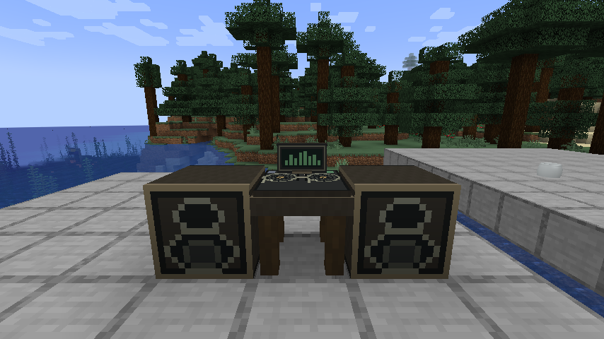
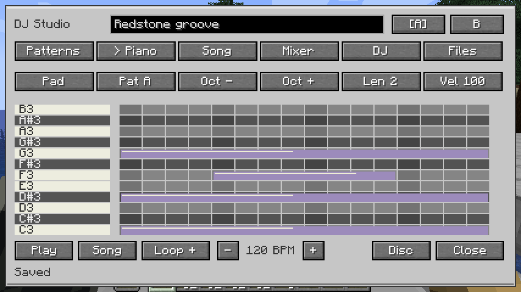
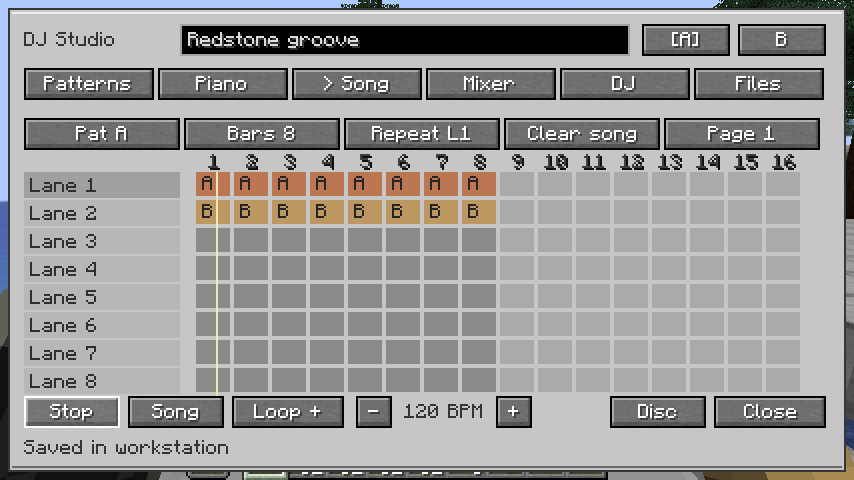
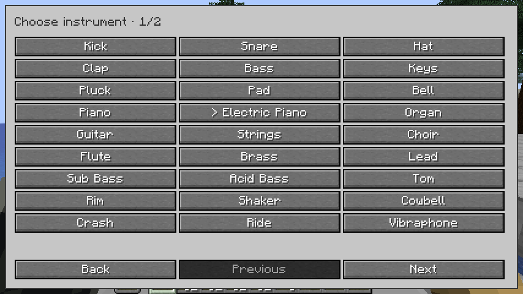
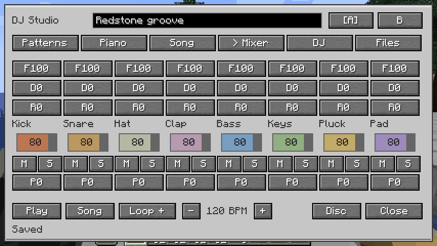
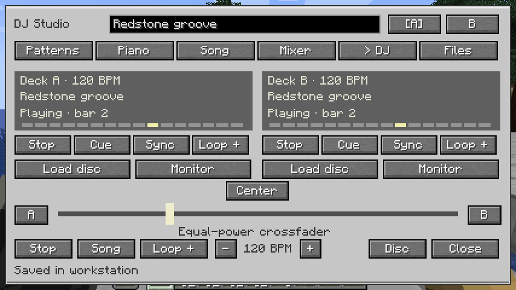
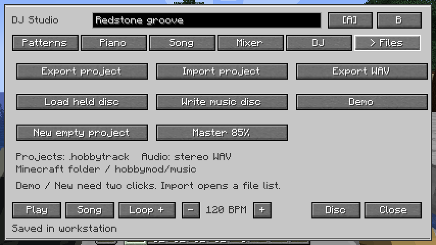

# DJ and music production

The **DJ Workstation** is a pattern-based, in-world music studio with a native Minecraft interface. Make drum patterns and melodies, arrange a song, mix it, save an editable disc, then perform a two-deck set for nearby players. It is an original sequencer and synthesizer, inspired by desktop DAW workflows. It does not include FL Studio code, VST plugins, microphone recording or a desktop DAW's complete tool set.

## First session

1. Craft a **DJ Workstation** from planks, iron, redstone and a note block. Right-click its desk or monitor.
2. Start in **Patterns**. Click or drag across steps to add beats; right-click or drag to erase. Select a channel by clicking its name. Each of the eight patterns (A–H) contains all eight instrument channels.
3. Use **Piano** for pitched instruments. The channel button cycles channels, and the pattern button cycles patterns. Draw a note and drag to set its duration. Drag an existing note to move it; **Shift-drag** changes its length. Right-click deletes it. Scroll over a note to change velocity, or over the keyboard to move the visible pitch range. The Oct buttons move by octaves. Chords are supported.
4. In **Song**, click or drag to place a complete pattern clip into playlist lane/bar cells. Each clip plays all instruments in that pattern. Stack A and B on different lanes at the same bar to hear both complete patterns together. Lanes are independent of mixer channels; clip colors identify patterns. Right-click erases. Each song can contain 64 bars; **Page** switches between four pages of sixteen bars. **Bars** sets the playback length. **Shift-click** a bar to cue it. Click a lane name to select it; **Repeat L1–L8** fills only that lane with the selected pattern, and **Clear song** requires a second click.
5. Choose **Song** or **Pat A–H** beside the transport controls, then **Play**. A new project without any arrangement automatically previews its selected pattern. Space starts/stops playback. The tempo is 60–200 BPM; use +/− or scroll over the BPM readout. Swing delays alternate sixteenth notes.
6. Project changes save to the workstation automatically. Ctrl+S flushes pending changes. Ctrl+Z undoes music edits; Ctrl+Shift+Z or Ctrl+Y redoes them. This history belongs to the open editor and is separate from permanent marble carving.

**Files → Demo** loads an editable starter groove after a second confirming click. **New empty project** also requires confirmation. The title box names your music.

## Instruments and mixer

Choose among **29 synthesized instruments**. Select a channel in Patterns, then click its instrument button to open the native, paged picker. Selecting a sound previews it.

- Drums and percussion: kick, snare, hi-hat, clap, tom, rim, shaker, cowbell, crash and ride.
- Basses and synths: bass, sub bass, acid bass, lead, pluck and pad.
- Keys and tuned percussion: keys, piano, electric piano, organ, bell, vibraphone, marimba and glockenspiel.
- Acoustic-style voices: guitar, strings, choir, flute and brass.

These are synthesized timbres, rather than recorded acoustic samples. **Copy >** copies all channels into the next pattern, and **Clear** clears the complete selected pattern after confirmation. Notes span MIDI 36–84 (C2–C6). Each one-bar pattern allows 48 notes per channel; a note can last up to a full bar.

**Mixer** provides eight channel strips:

- Drag the colored volume strip to adjust gain.
- **M** mutes, and **S** solos a channel. Multiple solos can play together.
- **P** changes stereo pan from left to right.
- **F** changes the low-pass filter cutoff.
- **D** changes beat-timed delay; **R** changes the reverb send.
- **Files → Master** changes the project's master output.

Scroll over a mixer parameter or volume strip for finer adjustment (1% increments, or 5% for pan).

The output uses a soft limiter. Audio is synthesized directly into Minecraft's sound engine under **Jukebox/Note Blocks** in sound settings. World playback reaches 24 blocks from a standalone desk. A **DJ Speaker** within two blocks horizontally and one vertically extends the listening range to 48 blocks; more speakers do not multiply volume. Distance attenuates playback smoothly.

## Live DJ set

Deck **A** and deck **B** hold independent projects. Switch the top A/B buttons to edit one. In **DJ**, each deck has play/stop, cue-to-start, sync, loop, disc loading and headphone monitoring. **Sync** matches the other deck's tempo and beat clock; if the other deck is playing, it starts the synced deck too. Both decks can play together. Drag the **equal-power crossfader** to blend them, or use A, Center and B.

Craft and carry **Studio Headphones** to use **Monitor**. Monitoring is a private, local stream of the selected deck, so you can cue a song while its public deck is faded out. Press Monitor again or close the studio to stop monitoring. Monitoring is additional audio: hearing the same deck publicly and privately adds both signals.

The desk's vinyl platters rotate during playback. Closing the editor does not stop public playback. Breaking or unloading the workstation stops its sound; songs remain stored, and playback is stopped when the saved workstation is loaded again. At most four public deck streams are active per client to bound synthesis cost.

## Discs, files and audio export

Carry a **Blank Music Disc** and choose **Disc** or **Files → Write music disc**. In survival, this consumes exactly one blank and returns a **Music Project Disc** containing the complete editable project. Creative recording needs no blank. Hold a recorded disc in either hand, choose a deck, and use **Load disc**. Loading does not consume it. These project discs are for DJ workstations, rather than vanilla jukeboxes.

Both complete deck projects and their settings survive world saving and workstation pickup/replacement. One nearby player edits a workstation at a time; others can hear its playback. Editing uses revision checks and bounded server-validated project files. Close releases the editing lease, and an abandoned lease expires after five seconds without a heartbeat.

Files are stored inside the running Minecraft instance at **`hobbymod/music`**:

- **Export project** writes a `.hobbytrack` file. Exporting the same project updates its existing file.
- **Import project** opens a paged list of local `.hobbytrack` files. Place shared files in that folder. Invalid, truncated or oversized files are rejected without replacing the current music.
- **Export WAV** renders the current deck's arrangement as 22,050 Hz, 16-bit stereo PCM with one second for effect tails. It runs in the background and does not require an audio device. Empty arrangement cells are silent. This exports the composed song, rather than a live recording of crossfader gestures.

Exports retain the song UUID in their filenames. File imports and exports run on the player's client, not the multiplayer server. The format is bounded at 20 KB: eight channels × eight patterns × 48 notes, plus eight playlist lanes of sixty-four bars and mixer metadata. New files use the HDJ2 format. HDJ1 files, saved workstations and discs load automatically: old channel selections are grouped into clips while retaining their original sound. A small pale corner mark and hover hint identify a migrated clip that uses only some channels. Click to replace it with a complete pattern clip. New HDJ2 files require the updated mod. Ordinary songs are much smaller.

## Validation

The final build passed **69 shared unit tests** and **54 Minecraft GameTests**.

The shared tests cover binary project round trips, malformed files, maximum project size, independent pattern copying, timing/swing/solo, complete-pattern layering, lane independence, whole-pattern copying, legacy HDJ1 migration, all 29 instruments, deterministic chunked synthesis, stereo pan/mute, effect output, sustained-note seeking, looping and WAV headers. Minecraft tests cover disc costs and loading, editing leases and stale commands, transport/sync/crossfade/speakers, workstation pickup/persistence, layered-pattern recording with new instruments, and one-shot completion.

Graphical checks exercised note drawing, resizing, velocity, undo, saved edits, arrangement, dual-deck playback, private headphone monitoring, rotating platters, mixer controls, project file import/export and actual WAV export. The original UI was checked at 854 × 480 and 640 × 480. The playlist update was play-tested at 854 × 480, including overlapping full patterns, repeating one lane, erase/undo, save/reopen and the paged instrument picker. Child screens also route pending save acknowledgements back to the workstation editor. The original DJ release also launched and ran in the normal production configuration with development GameTests disabled. Minecraft audio output was captured using OpenAL Soft's wave backend with other sound categories disabled: stopped playback was silent and playing the deck produced nonzero stereo output. [This eight-second recording](dj-live-set.wav) comes from that Minecraft sound-engine capture.

For cloud audio inspection, OpenAL Soft bundled with the Minecraft client supports a wave backend. A temporary config can use `[general] drivers = wave` and `[wave] file = /tmp/hobby-dj-audio.wav`; launch with `ALSOFT_CONF` pointing to it and `ALSOFT_DRIVERS=wave`. Normal players need neither setting. The capture file's length fields finalize when the client closes.
