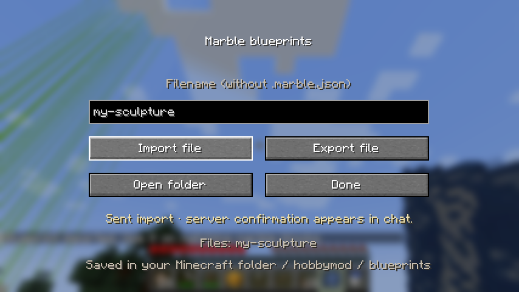
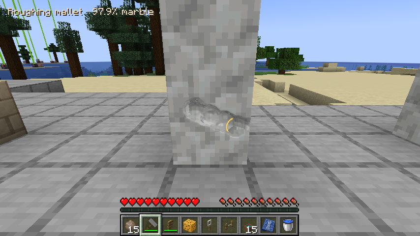

# Marble blueprints

Craft a **Marble Blueprint** with paper and lapis lazuli. A blank blueprint used
on marble captures the connected structure (plain marble and carved marble).
Sneak-use a filled blueprint to replace its design with a new capture.
The block you click is the anchor; block offsets keep their original world-axis
orientation. Capture supports up to 64 face-connected blocks, within 15 blocks
of the anchor in each direction. Separate your sculpture from other marble
before capturing it.

Use a filled blueprint on a marble block to apply its saved shape. For a
multi-block design, first place marble at each saved offset relative to the
clicked anchor. All blocks are checked before changing any: missing marble or
protected blocks reject the entire application. Blueprints are reusable, copy
smooth density and polish, and use the existing connected-marble support rules.
They do not create free marble or replace unrelated blocks. Applying replaces
the target carving, so capture an existing design first if you want to keep it.
There is no undo.



## Sharing files

Use a blueprint **in the air** to open its file screen. Enter a name and choose
**Export file** or **Import file**. **Open folder** opens the file location:

```
<Minecraft game directory>/hobbymod/blueprints/<name>.marble.json
```

For a development client this is normally `neoforge/run/hobbymod/blueprints`.
For a launcher instance it is inside that instance's game directory. Export a
captured blueprint, share its `.marble.json` file, then put a received file into
this folder and import its name into a held blueprint. Files stay on the client;
the validated design is sent to the server and saved on the item. Export uses a
new filename and never overwrites an existing file.

The format has a version, anchor-relative block positions, signed density and
polish. File size, decoded geometry, connected block positions, and compressed
network size are checked. Very intricate large designs may exceed the blueprint
item's size limit; capture smaller sections in that case.

## Drag carving



Hold left-click and move over the sculpture surface. Every server response,
including a stroke that makes no change, now releases the client to send the
next stroke. The held cursor is picked against the updated mesh each tick.
Server-side interpolation uses the surface before the stroke, so overlapping
brush samples do not skip one another. It connects consecutive accepted points across ordinary
network delays. Changing tools, orbiting or releasing the mouse ends a stroke.
