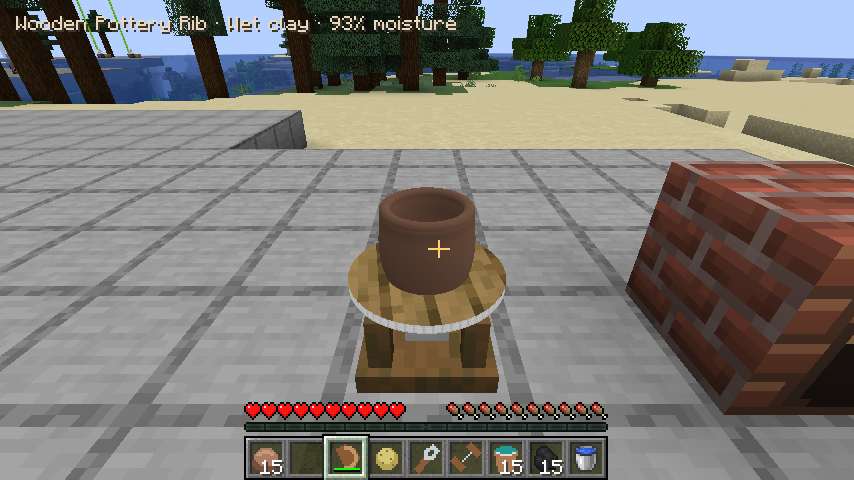
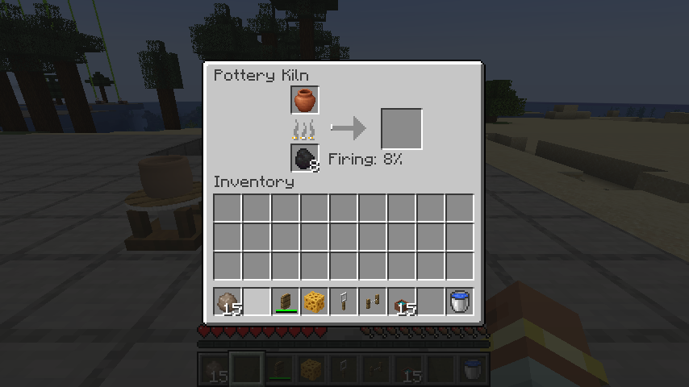
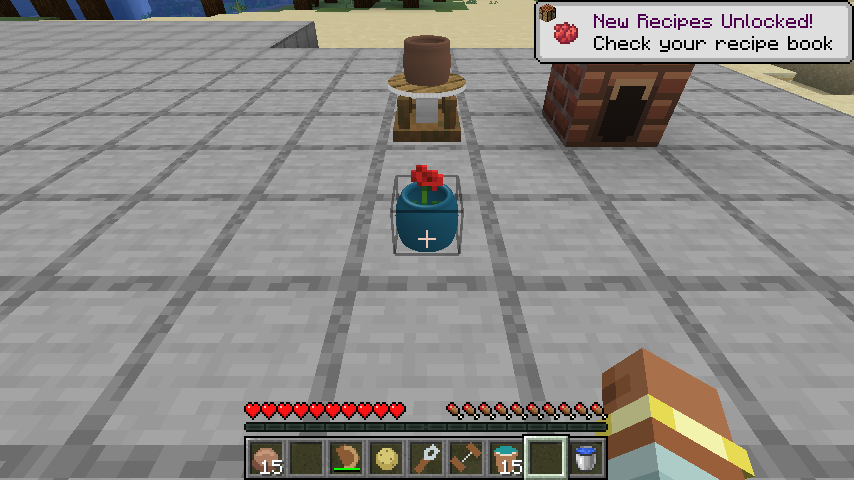

# Pottery

Pottery is thrown on a spinning wheel **in the world**, with inventory tools and
an orbit camera like marble sculpting. The shape is a continuous curved profile,
with an actual hollow cavity, connected walls, a floor, and a rounded rim. You
shape the whole circumference as the wheel turns; there are no finished presets.

## From clay to finished pot

1. Craft **Prepared Clay** from four clay balls and a water bucket. The bucket is
   returned by crafting. Craft a **Potter's Wheel** from three smooth stone slabs,
   an iron ingot, and three planks.
2. Place the wheel and use prepared clay on it. This loads a centered, solid lump;
   it consumes one prepared clay in survival. Select an empty hotbar slot and
   right-click the loaded wheel to start spinning and enter the world camera.
3. With empty hands, left-click the top of the lump to open its center. Drag on
   the sides to change the profile. Drag left to narrow or right to widen the
   selected ring. Start near the rim and drag upward to pull the pot taller, or
   downward to lower it. Drag height stays attached to that ring as the shape
   changes. Widening and pulling redistribute the original clay; impossible
   shapes that need walls thinner than the supported minimum are rejected.
4. Switch to the **Wooden Pottery Rib** or **Pottery Sponge** and hold left click
   over a ring to smooth its actual curvature. The sponge/rib does not create
   clay. Check the small moisture readout. If the clay is too dry, leave the
   camera and use a water bucket on the wheel, then return to shaping.
5. Leave the camera and use **Clay Cutting Wire** on the wheel to lift the pot
   off the head. Its custom shape and stage enter your inventory as a pot item.
   Place it to air-dry, or let it dry on the idle wheel. Placement follows the
   point you click on the supporting block, keeping the whole pot on that block. Keeping the wheel running
   pauses drying. Wet clay becomes **leather-hard after 60 seconds** of idle,
   loaded ticks. It becomes **bone dry after another 60 seconds**.
6. For foot trimming, put a leather-hard pot back on an empty wheel, right-click
   with the **Trimming Loop**, and hold left click near the bottom quarter of the
   pot. Trimming removes clay from the foot rather than adding it. Cut the pot
   off again and allow it to finish drying. A water bucket can rehydrate wet or
   leather-hard clay; bone-dry and fired clay cannot be thrown again.
7. Craft a **Pottery Kiln** from eight bricks around a furnace. Pick up your dry
   pot by sneaking and right-clicking it with an empty hand, or mine it. Use the
   kiln to open its furnace-style inventory. Put the dry pot into the upper-left
   input slot and coal or charcoal into the lower-left fuel slot. Wet and
   leather-hard clay are refused. Firing takes **30 seconds**, followed by
   **10 seconds of cooling**. Collect the **bisque pot** from the right output
   slot; hot pottery stays locked while it fires and cools. Shift-click transfers
   pots and fuel between the kiln and your inventory.
8. Place the bisque pot. Craft a glaze from one dye, one quartz, one clay ball,
   and a water bucket; this makes four portions and returns the bucket. All
   sixteen dye colors are supported. Use a glaze on the bisque pot, then pick it
   up and put it back into the kiln. The **second firing and cooling** produce
   the finished glazed pot. Unglazed bisque does not undergo this second firing.
9. Place the finished pot as a decoration. Fill its open center with a **water
   bucket** first; survival returns an empty bucket. Use a small flower on it to plant a
   real flower, rendered with its world block model. Right-click with an empty
   hand to remove the flower; shears also work. Sneak-right-click with an empty
   hand picks up the whole pot, preserving its flower. Mining or picking up the pot preserves
   its profile, glaze, stage, flower and water. Removing the flower leaves the
   water. Use an empty bucket afterward to recover the water. A pot with a flower
   refuses draining, and a pot that is already full does not waste another bucket.
   This stored water is separate from moisture used when throwing wet clay.

The wheel has a timber base and stone head. The clay rotates with the head while
working and retains its stopped orientation; a subtle clay grain makes its
rotation visible even on a symmetric pot.

Revised client captures: [wheel and rotating clay](pottery-rotating-clay.png)
and [water-filled flower pot](pottery-water-flower.png).

A dry pot shrinks slightly, and each firing shrinks its original geometry. The
kiln preserves the design rather than exchanging it for a generic pot. Fuel is
consumed only while firing; one coal or charcoal supplies enough heat for both
firings of one pot, with some heat left over. The kiln stores up to 64 fuel items.
Breaking a kiln drops its pot and unconsumed fuel. Drying, firing, and cooling
count only loaded server ticks; they do not run in your inventory or offline.

## Tools and controls

| Tool | Use | Recipe |
| --- | --- | --- |
| Empty hands | Open the center, push/pull the profile, lift the rim | Empty main hand |
| Wooden pottery rib | Smooth wet clay | Two planks above a stick |
| Pottery sponge | Smooth wet clay | Dried kelp, wheat, string |
| Trimming loop | Trim the foot of leather-hard clay | Two iron nuggets above a stick |
| Clay cutting wire | Remove the pot from the wheel | Two sticks and three strings |

| Input in wheel view | Action |
| --- | --- |
| Left click / drag with hands | Open the lump or shape the selected ring |
| Left click / hold with rib or sponge | Smooth wet clay |
| Left click / hold with loop | Trim leather-hard clay near its foot |
| Right / middle drag, or Alt + left drag | Orbit |
| Ctrl + wheel | Zoom |
| 1–9 / wheel | Choose the actual held hotbar item |
| E | Open your inventory, then return to the wheel |
| F | Reframe |
| Escape | Stop working and leave the camera |

The overlay shows your held tool, the pottery stage, and wet-clay moisture.
There is no tool palette or undo. Further in-game instructions are
in The Hobby Handbook. Tools wear in survival; creative does not
consume clay, glaze, water, flowers, or durability. Shape data is saved with the
block and item. Pot items share an inventory icon; placed pots show their own
geometry. Player reach and world protections are validated by the server.

## Development checks

Run `./gradlew --no-daemon :common:test`. Seven pottery tests verify fixed clay
volume, opening, smooth geometry and exact picking, watertight meshes, rounded
lips, profile smoothing, subtractive trimming, bounds, malformed data, saving,
drying, rewetting, and both firing stages.

Run `./gradlew --no-daemon -Pgametest :neoforge:runServer`, then `test runall`.
Nine pottery GameTests cover clay loading and shaping with stale/invalid edits,
wire pickup and placement, drying/trimming/water buckets, kiln fuel and cooling,
glazing/second firing/flower preservation, wheel/kiln reloads, and real
menu slot transfers, heat locks, empty-hand flower removal, off-center placement,
and pickup. Check nine
`POTTERY_TEST_PASS` entries, alongside fourteen `SCULPTING_TEST_PASS` entries.
Keep `-Pgametest` on simultaneous development client runs, and shut down the
server as described in the root README. A normal release build excludes tests.
