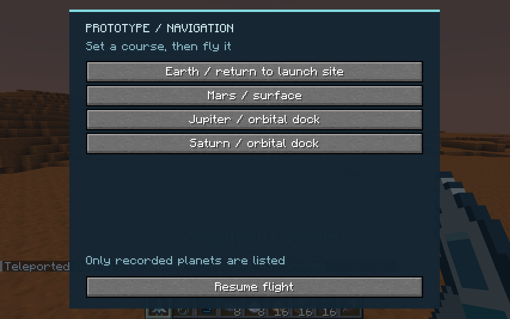
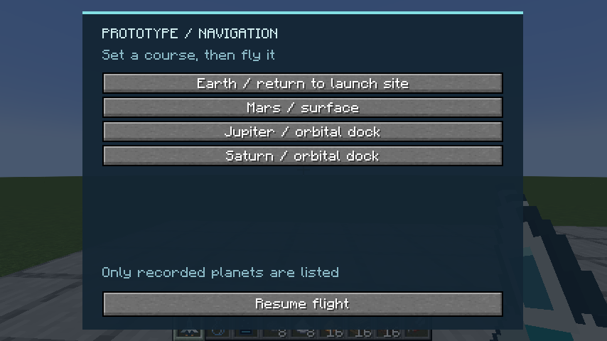
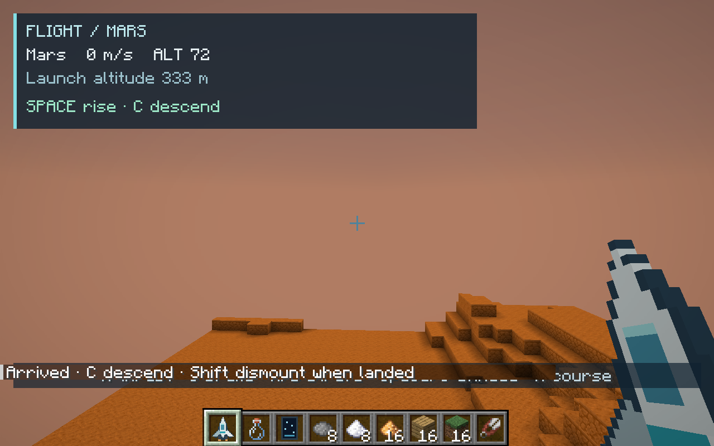
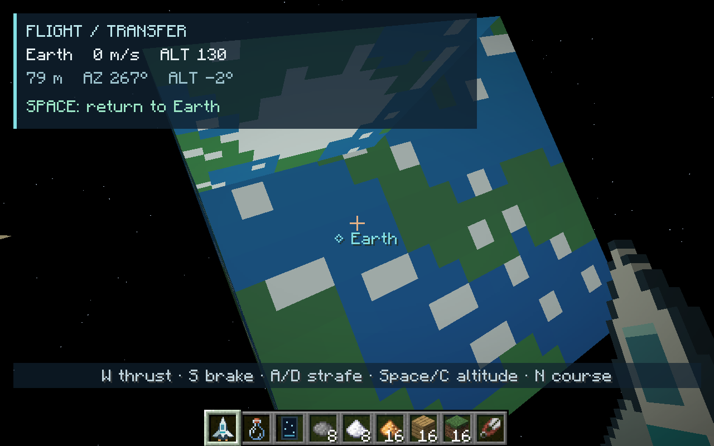
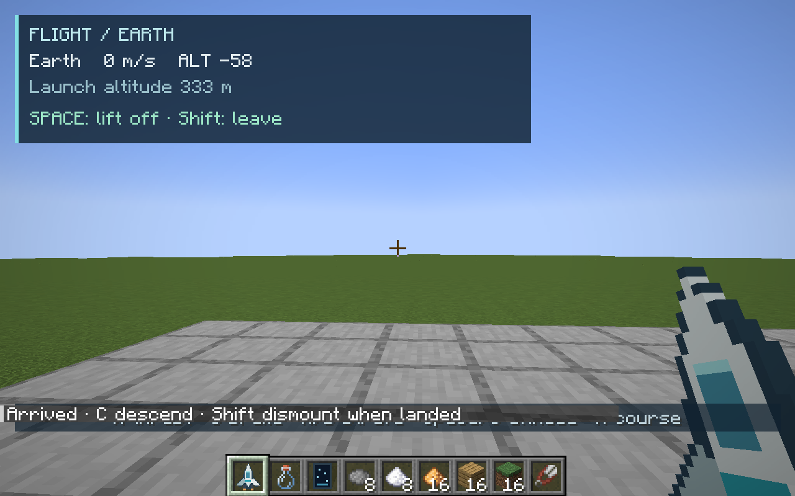
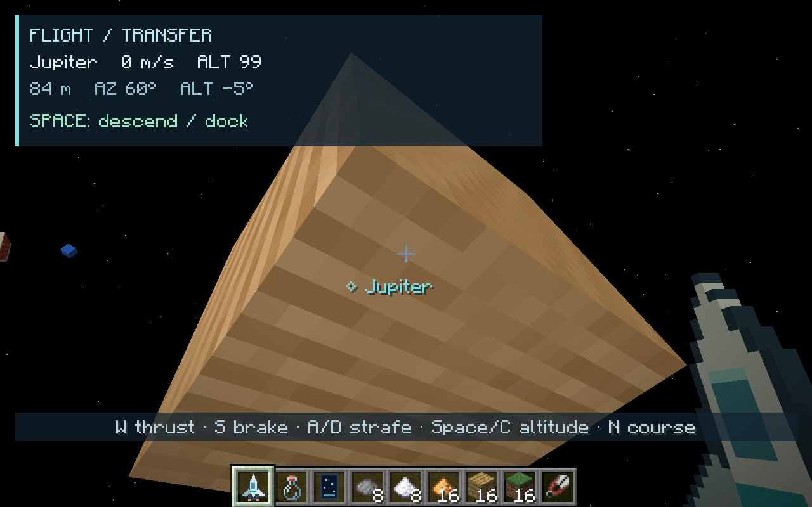
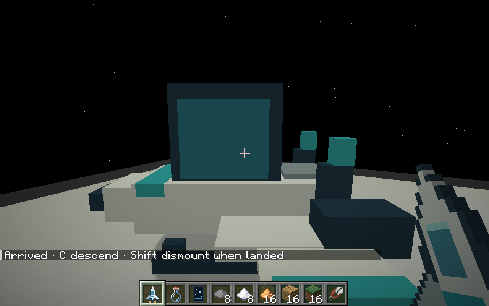
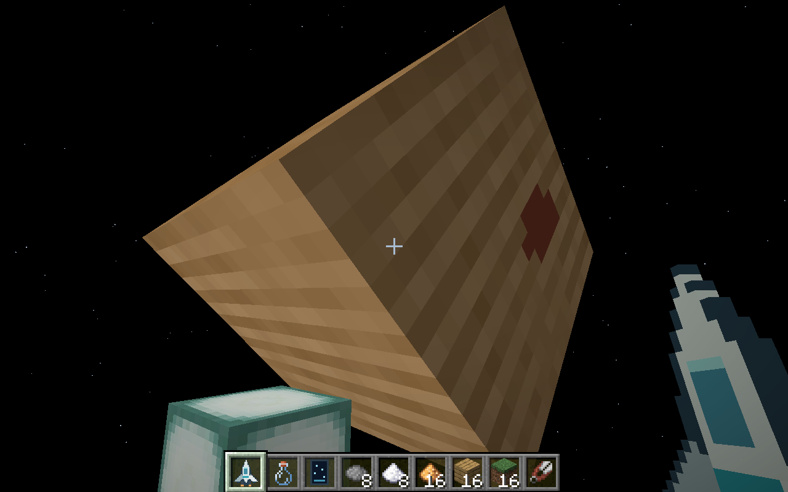
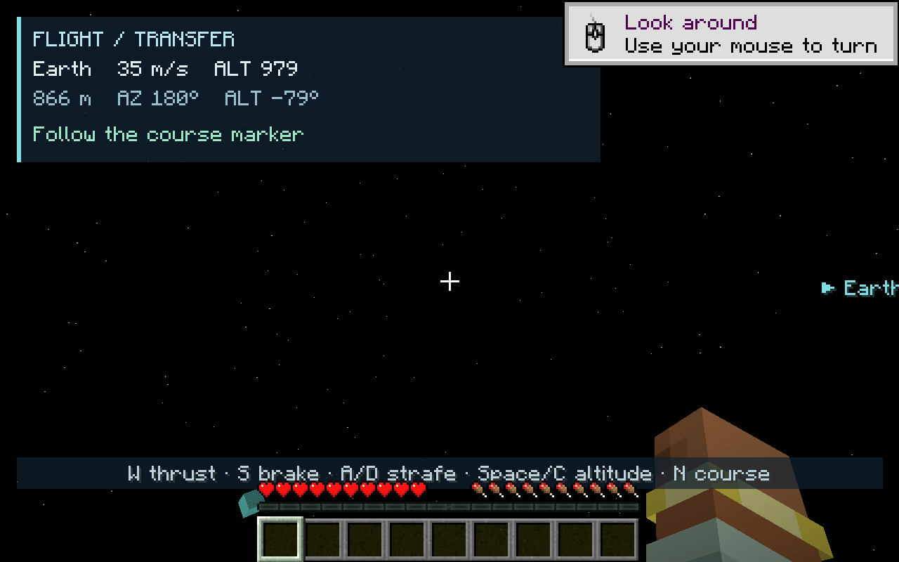

# Prototype spaceflight

Craft a **Prototype Spacecraft**, deploy it on a clear launch pad and right-click
to board. The recipe is glass over an iron-block/piston/iron-block row, with
copper-block/redstone-block/copper-block below. Leave a clear 4 × 4 × 3 area.
Deployment faces the direction you look. Crouch-right-click a parked, grounded
shuttle to pack it; its owner, identity and Earth launch site survive packing.

Navigation lists Earth and planets you have previously discovered with the
telescope. Selecting a destination sets a course without moving the craft.
The server validates discoveries, controls and dimension changes.

| Control | Action |
| --- | --- |
| Mouse | Aim the craft |
| W | Thrust forward |
| S | Brake |
| A / D | Strafe left / right |
| Space / C | Rise / descend |
| N | Change course |
| Shift | Dismount; land first |

Rise above altitude 332 to enter transfer space. Follow the destination marker
and bearing, use W to accelerate, and brake with S near the planet. Within
100 meters and below 15 m/s, press Space to descend or dock. On arrival, C
lowers the shuttle onto the ground. Flight has inertia; releasing W does not
immediately stop it. Opening navigation cuts thrust. Missing control packets
also stop thrust rather than leaving a craft accelerating unattended.

Mercury, Venus and Mars have separate generated rocky terrain worlds. Jupiter,
Saturn, Uranus and Neptune have solid orbital docks because they have no
walkable surface. Earth returns to the recorded launch site, above any existing
construction. Fly back through transfer space using the same controls.

Transfer space uses a compressed, fixed solar map. This keeps journeys playable
and prevents a time command from jumping a destination around during flight.
Rendered bodies retain their three-dimensional spin and textured faces. Arrival
generates the landing chunks and checks the whole hull's clearance before
transferring the craft and remounting its pilot. Falling out of an orbital world
without a ship recovers the player to Earth's spawn; the ship remains parked.

This first version is a single-seat entity shuttle, with no fuel, oxygen,
rocket assembly or detailed planetary ecosystems yet. Sable is optional: its
existing navigation adapter remains available, and the new worlds supply Sable
gravity/pressure metadata. Transferring player-built Sable block ships is a
separate future step; this prototype uses its own server-side flight physics.

## Original patch verification

The following results and screenshots were supplied with commit `b93546f`.

The full shared suite passed 98 tests. All 80 native GameTests passed both
without Sable and with official Sable 2.0.6 installed. Three shared flight/map
tests and five native flight tests cover deployment, discovery gating, input
expiry, packing, identity-preserving transfer and unobstructed arrivals.

Actual NeoForge client play-testing used Xvfb, Mesa OpenGL and mouse/keyboard
input. The shuttle was deployed and boarded, manually launched, aimed and flown
to Mars, landed and dismounted, then piloted back to its original Earth pad.
With Sable installed, a further piloted flight reached Jupiter and its orbital
dock, with landing and safe dismounting. The navigation screen was checked at
1280 × 800 and 854 × 480. All captures below were opened and inspected.
Mercury and Venus dimension registration is covered by native tests/data
loading; they were not visited during this graphical flight session.
Headless audio does not verify sound.

The client checks exposed and fixed a boarding-screen packet race, blurred GUI
text, an unloaded-chunk height-map landing bug, reversed strafe/marker direction,
and distant planets drawing over nearer bodies. The final shuttle capture also
checks the enlarged canopy and the offset nose trim without coplanar flicker.

## Validation after integration

The supplied patch was integrated with the newer handbook and Winery revisions.
The combined build passed 98 unit tests and all 81 Minecraft GameTests, including
five flight tests and all fifteen Winery tests. Book generation and validation
passed; Astronomy remains blank. The new Astronomy recipe is excluded from book
coverage alongside the other Astronomy recipes.

A fresh graphical client check without Sable deployed and boarded the shuttle,
confirmed undiscovered planets were hidden in navigation, and used the altitude
thruster to launch from the disposable Earth world into transfer space. The flight
HUD and transfer sky rendered correctly. Planetary arrivals and identity-preserving
round trips were exercised by the native tests; the original patch's manual Mars
and Jupiter journeys were not repeated during this integration check.

