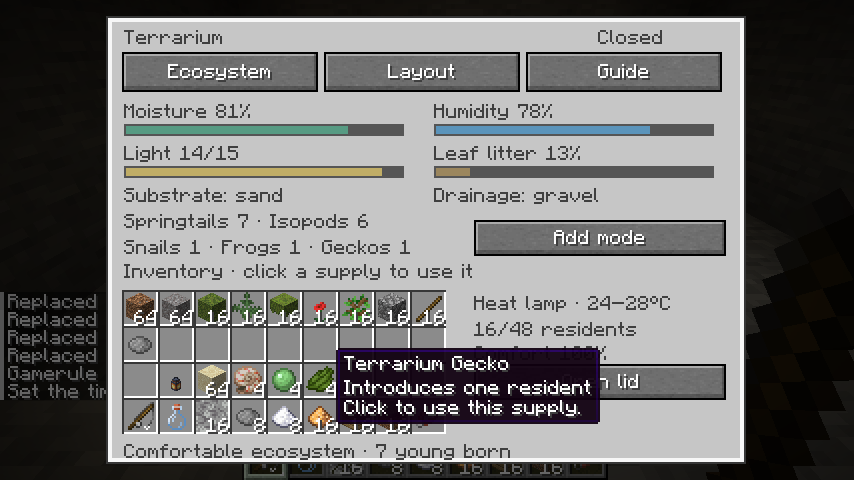
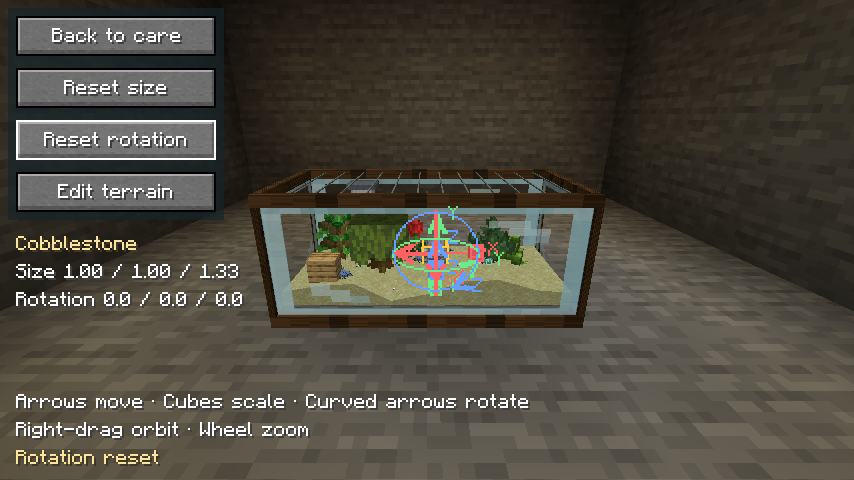
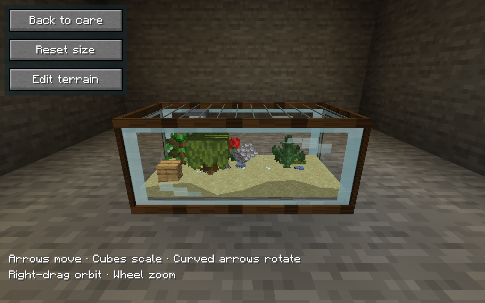
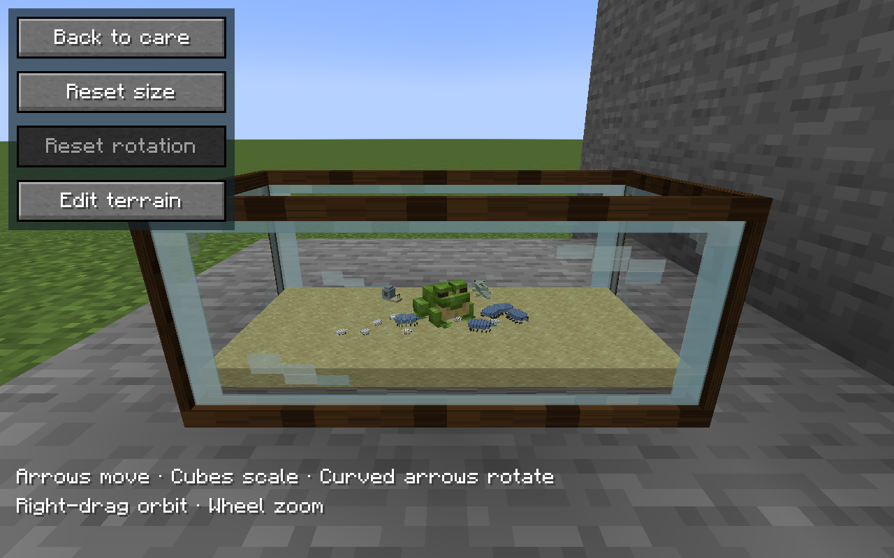
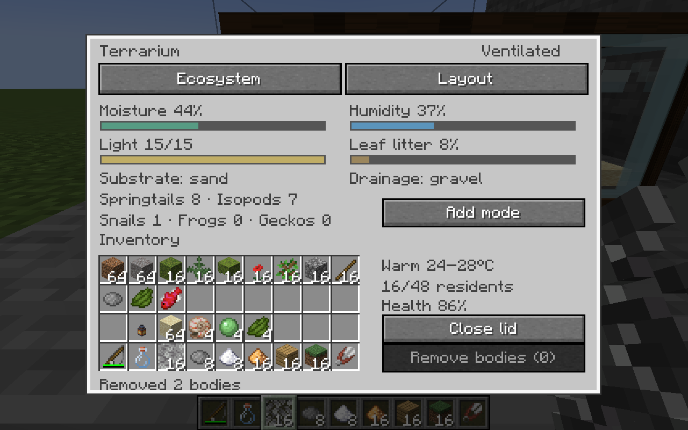
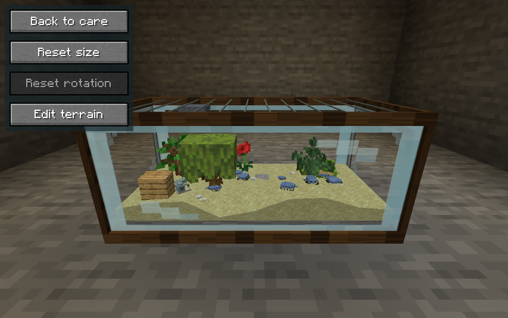

# Terrariums

Terrariums live beside aquariums in **HobbyMod: Habitats**. The starter enclosure
is 2×1×1, with the same placement facing, clear glass, native Minecraft block
models and in-world editor as aquariums. It contains land rather than water.
Existing aquariums keep their fish and water care.

## Setup and supplies

Craft the enclosure with eight glass surrounding a copper ingot. Place it on a
solid surface, then right-click to open **Ecosystem** or **Layout**.
The displayed inventory is your real inventory; supplies are consumed in
survival, and successful misting/trimming wears the tool.

| Supply | Use in Ecosystem |
| --- | --- |
| Gravel | Add drainage beneath the substrate |
| Dirt, sand or moss block | Select one of three substrate beds; swapping returns the old material |
| Terrarium mister | Raise moisture and humidity; craft from a glass bottle and iron nugget |
| Glowstone dust | Install a light strip for dark rooms |
| Terrarium heat lamp | Warm the enclosure and emit real level-14 Minecraft block light; craft three iron ingots over glass/redstone/glass, with blaze powder below |
| Magma cream / snowball | Select warm 24–28°C / mild 18–24°C; warmer closed enclosures dry slightly faster |
| Leaf litter | Feed colonies; craft leaves plus dried kelp for four portions |
| Springtail colony | Introduce three tiny inhabitants; craft litter, sugar and white dye |
| Isopod colony | Introduce three tiny inhabitants; craft litter and gray dye |
| Snail, tree frog or gecko | Introduce one animal; collect it in the wild with a habitat net |
| Habitat collection net | Right-click wild animals; fish also need a water bucket |
| Shears | Trim the most recently placed plant that still has height to trim |

Use **Remove / collect** to return installed drainage, substrate, lamps or up to
three residents of the selected colony type. A substrate cannot be removed
until its inhabitants are collected. Held supplies also work by right-clicking
the enclosure; sneak selects removal. Opening the lid improves ventilation and
speeds drying; closing it conserves moisture. Misting shows a brief spray, wet
soil darkens, and very humid closed glass shows light condensation.




## Layout and exact rotation

In **Layout**, choose a block from your inventory, then click the top view to
place it. The five starter plants are moss, fern, azalea, poppy and oak sapling.
Other allowed Minecraft blocks can form rocks, branches, backgrounds and
ornaments. The enclosure holds at most 28 pieces. Removal returns the actual
placed material.

Choose **Edit in 3D**, then click a piece in the actual world. Drag its arrows to
move it or its cubes to stretch along an axis. Right-drag orbits; wheel zooms.
Curved rotation arrows now surround the selected piece alongside its move
arrows and scale cubes. Drag the red ring for pitch, green for yaw or blue for
roll; hold Shift while dragging to snap the rotation change to 15° steps.
Angles remain precise without typing into separate GUI fields. The server
checks distance, permissions and bounds; tilted pieces shrink or move to fit
inside the enclosure. Decoration orientation, scale and location are saved
and carried with the tank. Reset size and **Reset rotation** remain available. Reset rotation clears all three angles while keeping position and scale; aquariums also have the button. Lower the green movement arrow to bury rocks, roots or blocks in the terrain. The tank floor limits burial depth.





## Peaks, valleys and indoor lighting

From the 3D editor choose **Edit terrain**. Select **Raise**, **Lower** or
**Smooth**, then hold or drag on the substrate. A brush outline follows the
surface. Shift temporarily lowers; Shift + wheel changes brush size. Hold in
one place to keep changing that spot as the surface rises or falls. Choose
**Edit objects** to return to decoration handles. Soil, sand and moss all
support shaping; the saved height field stays bounded beneath the glass.
Decorations stay grounded and shrink if necessary to fit beneath the lid;
residents follow the terrain height while crawling forward.

Gravel drainage and the sand bed are substantially thicker than the original
flat layer. Valleys retain a minimum substrate thickness above drainage. Relief
is saved when chunks unload and when the enclosure is mined and carried.

A **Terrarium Heat Lamp** mounts a small hood and warm bulb under the lid.
Install it from Ecosystem or remove it in Remove / collect mode. It emits real
Minecraft block light, warms the habitat and supplies light level 14 indoors;
ordinary light strips supply ecosystem light level 12. The lamp and terrain
survive carrying. Unlit habitats use ambient lighting rather than making tiny
inhabitants glow in a dark room. The care light readout refreshes as lamps or
room lighting change.



## Care and mortality

The server advances care once per loaded minute. Moisture, humidity, light,
food and average resident comfort are visible in the care screen. Plants help
retain humidity; a lamp overrides environmental light. Leaf litter is consumed
slowly. Poor conditions reduce health by two points per loaded minute; healthy
conditions restore two. Misting and feeding allow recovery before health reaches
zero. At zero, residents die and remain visible as stationary bodies.
**Remove bodies** clears them without creating living carriers. Dead residents
never recover, breed or get collected as living animals. Unloaded or broken enclosures pause
simulation; elapsed unloaded time does not cause a care penalty on return.

Closed, planted, comfortable colonies with at least two mature inhabitants can
produce young every eight loaded minutes. Residents inherit a color variant
and record a parent ID. Tiny juveniles grow, and the population stops at 48.
Collected colony items preserve individual IDs, ages, comfort, lineage and
variants, with variant names shown in their tooltip. Mining the enclosure
returns its kit with all care state, inhabitants and layout saved.

Springtails and segmented isopods are cosmetic residents, not world entities.
Their seeded paths stay inside the enclosure; no pathfinding or escaping world
entities run when the lid opens. Distant rendering reduces animation detail.
Plant integrations can extend the `hobbymod:terrarium_plants` block tag.
Full animal entities, disease, paludariums and custom background assets are
future extensions.

## Validation

Thirteen shared terrarium tests cover recoverable neglect, long-running capped breeding,
resident collection, save compatibility, 6,000 rotated layouts and bounded
seeded motion, trapped-agent recovery, frame-rate independent hops and permanent
death. Nine native GameTests exercise real land-kit placement,
survival supply consumption and refunds, colony identity round trips, arbitrary
rotation, mining/replacement, wild capture without duplication, fish water vessels,
native entity settings, biome spawn coverage and corpse cleanup without live
item duplication. These bring the suite to 54 shared tests and
49 native GameTests. The normal release build excludes development GameTests.

Graphical NeoForge client testing used Java 21, Xvfb and Mesa software OpenGL.
Screenshots were captured and opened with the image-viewing tool. Checks
included visible native plants behind glass, dry land without an aquarium
water plane, tiny colored residents, all five plants, real supply clicks,
colony collection and restoration, breeding after loaded time advancement,
unloaded-time pause, open/closed lid controls, exact 37.5° / 12.25° / −8.5°
rotation, multiple nearby enclosures and editor/care layouts at smaller window
sizes. The follow-up checks exercised curved rotation handles, hold-to-raise,
lowering, smoothing, thicker sand/gravel, forward-facing crawlers over hills,
and installing/removing a heat lamp in a sealed room. Additional tests cover
model heading alignment, bounded relief, decoration grounding and carrying
the shaped enclosure with its emitted lamp light. Compiled code and simulations alone do not establish visual correctness.

## Living inhabitants and wild collection

Springtails and isopods alternate exploration, resting, grooming and visits to
food. Feet move with actual travel; feelers and heads inspect their surroundings.
They steer gradually and avoid solid hardscape and the glass. Snails crawl slowly
with moving feelers; geckos make quicker excursions; tree frogs hop and use the
native Minecraft frog model and animations. Young animals are smaller. Closed
enclosures still contain saved cosmetic residents rather than full entities.

Craft a **Habitat Collection Net** using this pattern (S = string, N = iron
nugget, I = stick, · = empty):

```
·SS
·NS
I··
```

Wild bugs, snails, frogs and geckos spawn in forests, plains, jungles and swamps.
Aquarium fish spawn in rivers and warm/lukewarm oceans. Rivers provide cool-water
species; warm oceans provide warm-water species. These use normal Minecraft
spawn caps and spawning conditions, so sightings take exploration. Existing
chunks can spawn inhabitants too; no new terrain generation is required.

Right-click an animal with the net to collect that individual. To catch a fish,
carry a water bucket: it becomes the fish's carrying vessel, and introducing the
fish into an aquarium returns an empty bucket. Wild aquarium fish can also be
caught directly with a water bucket. The net wears only on successful capture.
Color variants and individual IDs survive capture, introduction and collection.
Colony crafting remains an alternative for the original bugs.




The wildlife update was checked again in a graphical client. Captured screenshots
were opened and inspected at 854×480 and 1280×800, including successive movement
frames, native frog colors, visible feet and feelers, live resident counts,
rotation reset and Y-arrow burial. Survival mouse interactions captured a real
wild gecko and fish; fish capture without a water bucket showed the recovery
hint. Spawn biomes and complete fish species availability were checked by native
GameTests, rather than waiting for random sightings in the flat QA world.

## Movement, plants and simpler controls

Blocked residents choose a clear route or rest without repeatedly rotating; they
resume exploration when an obstacle is removed. Frogs are smaller, with brief
vanilla jump animations and pauses between hops. Animation advances on game
ticks rather than rendering frames, and each enclosure has its own frog proxies.
Saplings and azalea use culled native cutout faces to avoid drawing both sides
of a plant plane at the same depth.

Care screens now contain Ecosystem/Fish and Layout tabs, essential statistics,
normal item tooltips and actual warnings. Repeated tutorials and guide panels
have been removed. The 3D editor keeps its handles and concise control names.

The follow-up graphical play-test opened captures at 854×480 and 1280×800.
Front and side views showed complete plant faces, smaller upright frogs,
changing bug positions and stationary bodies. Clicking Remove bodies removed
two residents, reduced the count and disabled the empty cleanup control.




