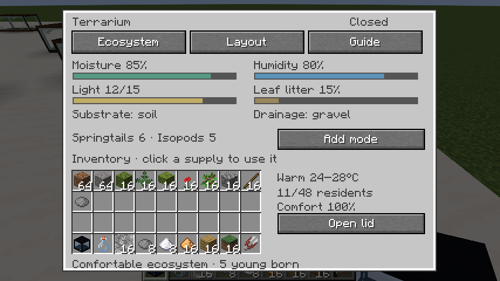
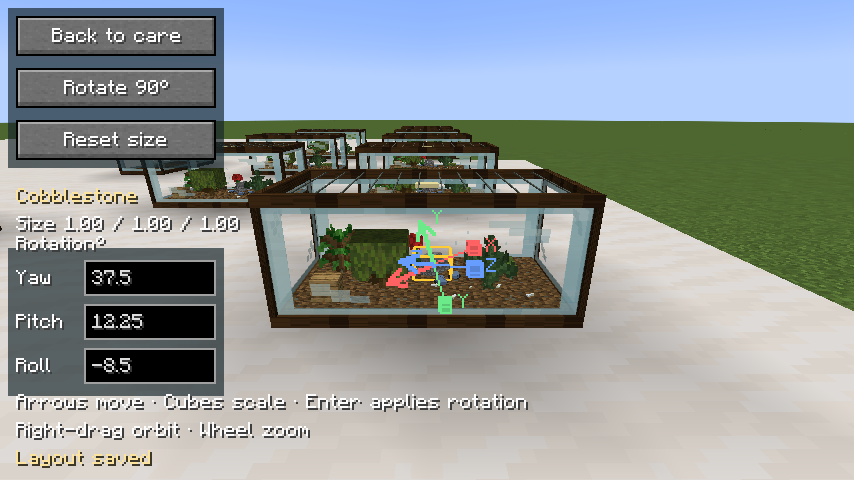
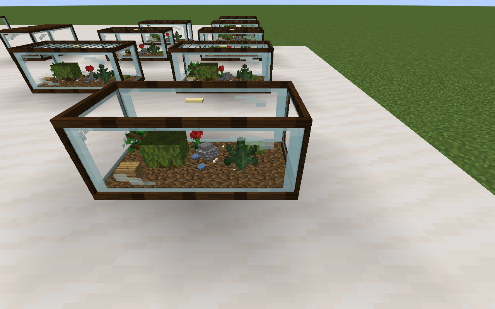

# Terrariums

Terrariums live beside aquariums in **HobbyMod: Habitats**. The starter enclosure
is 2×1×1, with the same placement facing, clear glass, native Minecraft block
models and in-world editor as aquariums. It contains land rather than water.
Existing aquariums keep their fish and water care.

## Setup and supplies

Craft the enclosure with eight glass surrounding a copper ingot. Place it on a
solid surface, then right-click to open **Ecosystem**, **Layout** or **Guide**.
The displayed inventory is your real inventory; supplies are consumed in
survival, and successful misting/trimming wears the tool.

| Supply | Use in Ecosystem |
| --- | --- |
| Gravel | Add drainage beneath the substrate |
| Dirt, sand or moss block | Select one of three substrate beds; swapping returns the old material |
| Terrarium mister | Raise moisture and humidity; craft from a glass bottle and iron nugget |
| Glowstone dust | Install a light strip for dark rooms |
| Magma cream / snowball | Select warm 24–28°C / mild 18–24°C; warmer closed enclosures dry slightly faster |
| Leaf litter | Feed colonies; craft leaves plus dried kelp for four portions |
| Springtail colony | Introduce three tiny inhabitants; craft litter, sugar and white dye |
| Isopod colony | Introduce three tiny inhabitants; craft litter and gray dye |
| Shears | Trim the most recently placed plant that still has height to trim |

Use **Remove / collect** to return installed drainage, substrate, lamps or up to
three residents of the selected colony type. A substrate cannot be removed
until its inhabitants are collected. Held supplies also work by right-clicking
the enclosure; sneak selects removal. Opening the lid improves ventilation and
speeds drying; closing it conserves moisture. Misting shows a brief spray, wet
soil darkens, and very humid closed glass shows light condensation.

## Layout and exact rotation

In **Layout**, choose a block from your inventory, then click the top view to
place it. The five starter plants are moss, fern, azalea, poppy and oak sapling.
Other allowed Minecraft blocks can form rocks, branches, backgrounds and
ornaments. The enclosure holds at most 28 pieces. Removal returns the actual
placed material.

Choose **Edit in 3D**, then click a piece in the actual world. Drag its arrows to
move it or its cubes to stretch along an axis. Right-drag orbits; wheel zooms.
The shared editor also provides reset size and a 90° rotation shortcut.
Terrariums additionally expose **Yaw**, **Pitch** and **Roll** fields: enter
finite decimal degrees from −360 through 360 and press Enter. Each field uses
an absolute angle, so entering 37.5 twice keeps the same rotation. The server
checks distance, permissions and bounds; tilted pieces shrink or move to fit
entirely inside the enclosure. Decoration orientation, scale and location are
saved and carried with the tank.

## A gentle display ecosystem

The server advances care once per loaded minute. Moisture, humidity, light,
food and average resident comfort are visible in the care screen. Plants help
retain humidity; a lamp overrides environmental light. Leaf litter is consumed
slowly, and a dry or hungry colony loses comfort rather than dying randomly.
Misting and feeding allow it to recover. Unloaded or broken enclosures pause
simulation; elapsed unloaded time does not cause a care penalty on return.

Closed, planted, comfortable colonies with at least two mature inhabitants can
produce young every eight loaded minutes. Residents inherit a color variant
and record a parent ID. Tiny juveniles grow, and the population stops at 48.
Collected colony items preserve individual IDs, ages, comfort, lineage and
variants, with variant names shown in their tooltip. Mining the enclosure
returns its kit with all care state, inhabitants and layout saved.

Springtails and segmented isopods are cosmetic residents, not world entities.
Their seeded paths stay inside the enclosure; no pathfinding or escaping world
entities run when the lid opens. Distant rendering reduces animation detail.
Plant integrations can extend the `hobbymod:terrarium_plants` block tag.
Full animal entities, disease, paludariums and custom background assets are
future extensions.

## Validation

Five new shared tests cover recoverable neglect, long-running capped breeding,
resident collection, save compatibility, 6,000 rotated layouts and bounded
seeded motion. Four native GameTests exercise real land-kit placement,
survival supply consumption and refunds, colony identity round trips, arbitrary
rotation and mining/replacement. These bring the suite to 45 shared tests and
44 native GameTests. The normal release build excludes development GameTests.

Graphical NeoForge client testing used Java 21, Xvfb and Mesa software OpenGL.
Screenshots were captured and opened with the image-viewing tool. Checks
included visible native plants behind glass, dry land without an aquarium
water plane, tiny colored residents, all five plants, real supply clicks,
colony collection and restoration, breeding after loaded time advancement,
unloaded-time pause, open/closed lid controls, exact 37.5° / 12.25° / −8.5°
rotation, multiple nearby enclosures and editor/care layouts at smaller window
sizes. Compiled code and simulations alone do not establish visual correctness.
