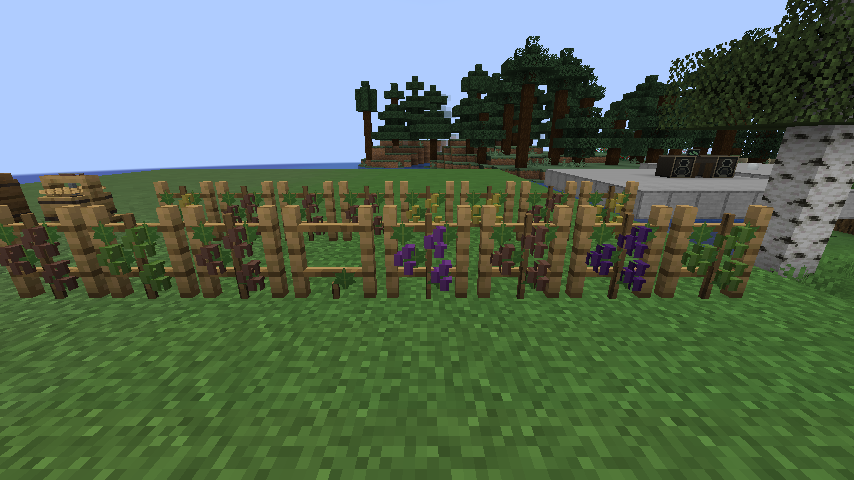
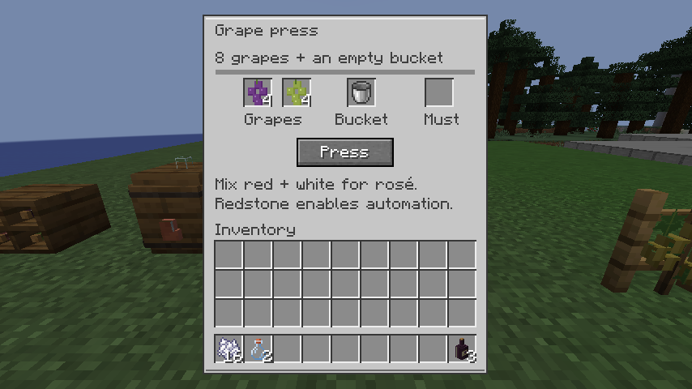
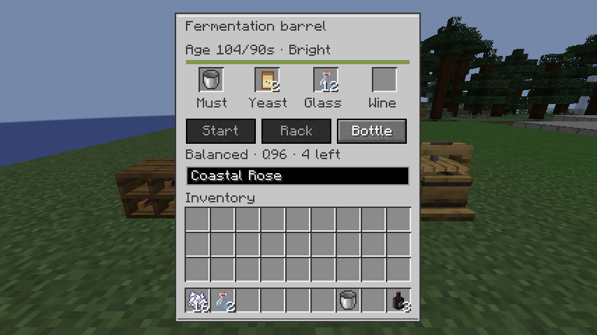
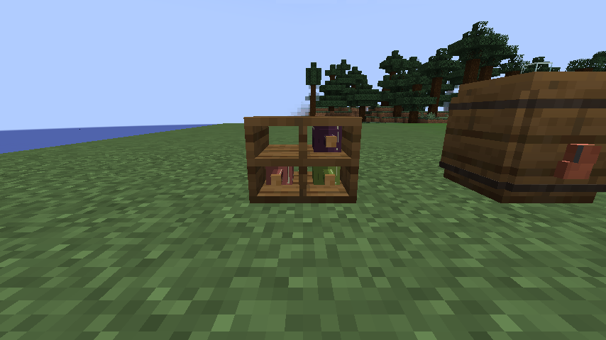
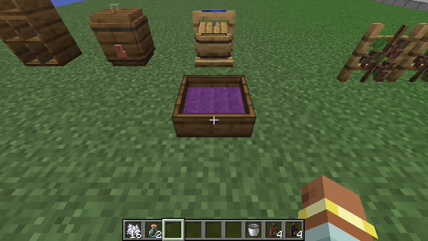
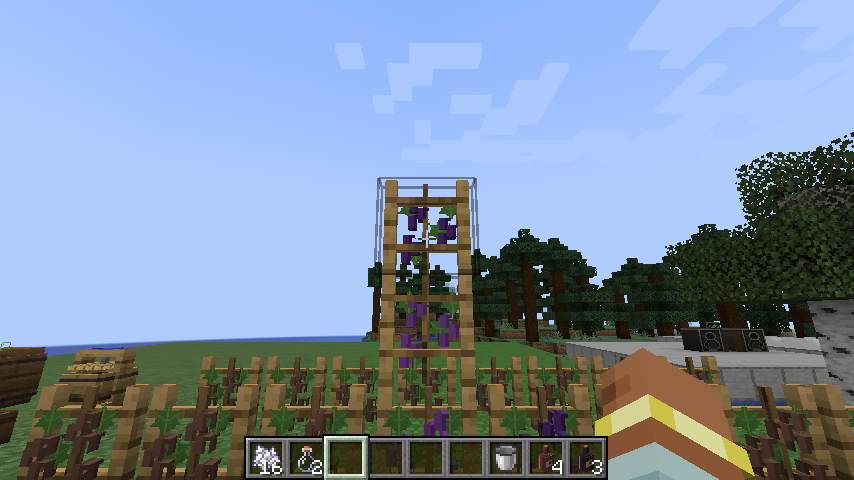
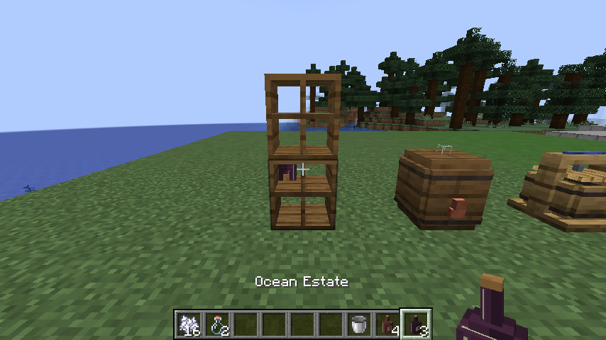
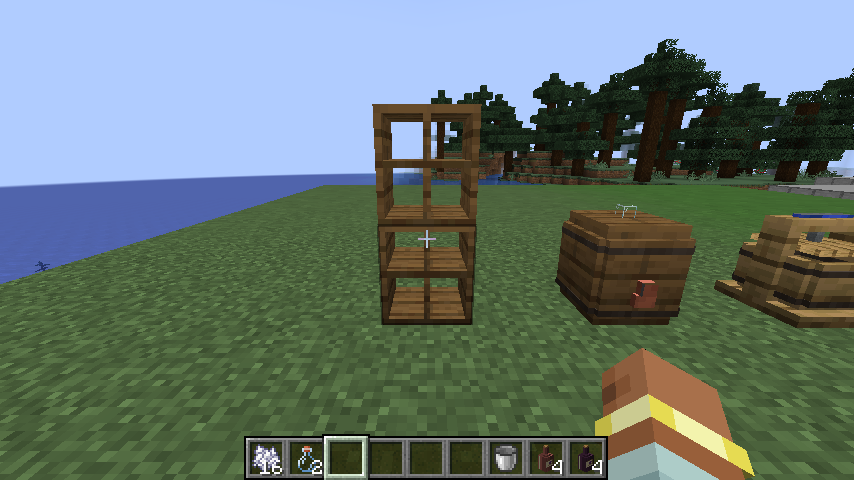

# Winery

Grow a little vineyard and turn its harvest into your own labeled vintages.
This hobby uses a few meaningful choices rather than a chemistry simulator.

All items are in the **HobbyMod: Winery** creative tab; wine itself is made in
batches rather than supplied as a blank decorative bottle.

## From vineyard to bottle

1. Place a **grape trellis** on dirt, grass or farmland. Right-click it with a
   red or white grape cutting. The vine needs light to grow. Bone meal brings
   it to ripe grapes; later ripeness happens naturally. Stack trellises to make
   taller vines: plant a cutting at the bottom. Its stem grows upward into
   each available trellis, one section at a time. Bone meal on the base helps
   the growing tip; each developed section grows its own grapes. Only the
   bottom needs soil. Harvesting leaves the supporting stem intact.
2. Right-click a vine to harvest. Firm grapes give three fruit; ripe and later
   stages give four. The vine stays planted and regrows. Outdoor, sun-grown
   grapes have a small quality bonus.
3. Put **eight grapes and an empty bucket** in a grape press. The two grape
   slots let you blend colors and harvests. Click **Press**. Its wooden plate
   moves while it works; after three seconds, collect the bucket of must.
   Alternatively, right-click a **grape treading tub** with eight grapes, then walk inside. Six seconds inside presses the
   grapes; stepping out pauses the work. The shallow floor permits entry from
   all four sides and does not require standing exactly in the center. The
   front strip fills amber while pressing; at completion it turns green, the
   mash becomes juice, and small green sparkles appear. Right-click with an
   **empty bucket** to collect one bucket of must. No bucket is needed before
   pressing. Crouch and empty-hand click to retrieve unpressed supplies.
   Older saves that already include a bucket return it without charging another.
4. Put must and **one wine yeast** in a fermentation barrel and click **Start**.
   Collect the returned empty bucket. Fermentation takes one minute. Keep the
   barrel away from fire, lit campfires and lava for better quality.
5. Once fermented, click **Rack**. This begins aging in the same barrel, so
   there is no second machine to craft. Racking is a single gameplay step that
   represents transferring wine away from sediment.
6. Let it age in a dark, cool cellar. The screen shows elapsed and recommended
   age, quality, and whether the location is hot, bright or dark. White wine's
   recommended age is one minute, rosé's is 90 seconds, red's is two minutes.
   You can bottle early; leave it beyond three times the recommended age and
   quality starts declining.
7. Add glass bottles, optionally type a label, and click **Bottle**. Each batch
   fills **four bottles**, using one glass bottle each. You can bottle a few
   now and the rest later; the first bottling fixes that vintage's name and
   tasting record. Bottle stacks contain only one batch.
8. Right-click a wine rack with a bottle to display it. Right-click with an
   empty hand on that bottle’s slot to take it back. Each rack holds four.
   Racks stack without gaps and inherit the neighboring rack’s facing. Hold right-click to
   taste a bottle; it returns the glass. Good-quality wine gives 30 seconds of
   Haste. Short traits appear one at a time above the hotbar, with a gentle
   drift: for example, “Dark berries…” followed by “Oaky…”. Each lasts 2.2 seconds.

Rinse an empty, used barrel by putting a water bucket in its must slot and
clicking **Rinse**. Dirty barrels still work, but the next batch is cloudy and
loses some quality. There is no destructive fermentation failure.

## Harvest choices

| Ripeness | Appearance | Result |
| --- | --- | --- |
| Firm | Green grapes | Tart, lower-quality harvest |
| Ripe | Red or pale grapes | Reliable quality |
| Late harvest | Darker red or golden grapes | Sweeter, slightly higher quality |
| Overripe | Brown fruit | Sweet, lower-quality harvest |

A mostly red pressing produces red wine; mostly white produces white wine.
Middle blends produce rosé. Sugar, acidity, tannin, maturity and oak influence
short tasting notes. They are simple gameplay values, not real-world chemistry.
The vintage is the world's day when pressing starts.

## Crafting

| Item | Recipe |
| --- | --- |
| Two trellises | Six sticks around a plank (`S S / SPS / S S`) |
| Two red cuttings | Sweet berries + stick, or red grapes + stick |
| Two white cuttings | Glow berries + stick, or white grapes + stick |
| Grape press | Iron ingot / three planks / wooden slab, piston, wooden slab |
| Grape treading tub | Five planks (`P P / PPP`) |
| Fermentation barrel | Vanilla barrel + copper ingot + glass bottle |
| Wine rack | Three planks, three sticks, three planks in rows |
| Four yeast | Bread + sugar |

Buckets and glass bottles use vanilla recipes. There is no copied Vinery code
or artwork; its vineyard workflow is the inspiration for this original hobby.

## Moving and automation

Breaking a working press refunds the reserved fruit and bucket. Breaking a
barrel drops a portable wine cask with its current batch; place it in another
barrel and click **Resume**. A cask does not create another empty bucket.
Breaking racks returns their bottles.

Supply ingredients through hoppers from above or the sides. A hopper below
extracts finished must or wine and a barrel's returned empty buckets. A redstone
signal enables automatic mechanical pressing. The treading tub needs a player
inside, even when supplied by hoppers. Powered barrels automatically start supplied
must, rack after fermentation, and bottle at the recommended age. Keep empty
buckets extracted so the must slot can receive the next batch. Rinsing is manual.
Automation uses ordinary item inventories, which can also be supplied by mods
that interact with Minecraft containers; there is no custom Create fluid pipeline.

The press accepts the shared `c:fruits/grapes` tag. Red/white grape tags include
optional Vinery item IDs, so those grapes can coexist in recipes and pressing
when installed. This release has not been tested with Vinery or Create installed.

## Saves and multiplayer

Each pressing has a unique batch UUID and a compact vector of gameplay values.
Active batches are saved with their machine or portable cask. Bottling puts one
immutable tasting record in the overworld's saved cellar data. Bottles carry that
UUID, label, vintage, color and a quality display snapshot, rather than copying
the full vector. Different batches never stack together.

A central issue count allows at most four bottles from a batch, including stale
or duplicated casks. This is a production safeguard, not protection against
creative commands that directly copy finished items. Finished bottles moved to
another world retain their appearance and label and can be drunk, but the original
tasting record and quality-based buff require that world's cellar data.

Fermentation and aging sample once per second while loaded and catch up by
elapsed game time when reloaded. They progress while the world is running,
including unloaded chunks; a stopped server does not count real-world hours.
Unloaded intervals use the last sampled cellar conditions. Changing the daylight
clock with `/time` changes the vintage but does not speed up fermentation.

## Development checks

Run `./gradlew --no-daemon :common:test` for the shared regression suite. Winery's
11 pure-Java tests cover ripeness/blending, fermentation/racking/aging, unloaded
elapsed time, clock rollback, malformed saves, UUIDs and duplicate issuance.

Run `./gradlew --no-daemon -Pgametest :neoforge:runServer`, then `test runall`.
Fifteen Winery GameTests cover vine planting/harvest permissions, powered barrel automation, pressing costs and interrupted-work refunds, full batches,
unloaded/restored casks, duplicate casks, rinsing and server reach checks, powered
pressing with a real output hopper, rack saves/stack identity, and tasting/glass
returns. Additional checks cover clearing stale inventory snapshots, targeted
rack removal and stacking, progressive climbing and added trellises, tub pause/reload/bucket collection,
rim clearance, and older bucketed saves. Keep `-Pgametest` on simultaneous client runs. See the root README for
safe server shutdown. Normal release builds exclude the tests and test structure.

The completed Winery was inspected in a running NeoForge 1.21.1 client.
Gameplay checks included bone-meal growth, shift-click pressing, fermentation,
racking, aging, custom label delivery, bottling and rack insert/remove. A saved
vintage was tasted after a server restart; its original notes, quality reward
and glass returns survived. Client review caught and fixed the missing inventory
panel, clipped press hint, shelf intersection and rosé model selection. The
screenshots above are direct game-window captures; rack color variations were
prepared with development commands to check all three models.

The revisions were also checked in the live client: stacked trellis rendering,
insert/remove updates on stacked racks, tub pressing and collection, and the
short tasting overlay. New screenshots show the three-block vine, filled tub,
and the same rack slot before and after removal.

The earlier rack/tub revisions passed 91 unit tests, all 73 GameTests
(14 Winery), and the NeoForge release build. The production jar contains no GameTests, test structure or JUnit classes.

## Recovery of the remaining Winery fixes

The later unpublished edits were recovered from the original conversation and
integrated with the current handbook and Astronomy code. Existing racks,
tasting, mechanical pressing, barrel processing and automation remain covered
by their regression tests. Tub collection supports both ready unbucketed juice
and older saves with a reserved bucket or a completed must bucket.

Current validation: 95 unit tests and all 76 Minecraft GameTests passed,
including 15 Winery tests. The recovered tests check gradual vine growth,
newly added trellises, root soil, off-center feet, collision clearance, paused
and reloaded tub progress, exact bucket consumption and older bucketed saves.
The normal release build and book generator/validator also pass.

The graphical survival check walked into the tub from the ground, pressed
without loading a bucket, stepped out to pause, and collected exactly one must
bucket. The progress strip rendered amber, then green with juice and sparkles;
collection cleared the tub. Planting affected only the bottom of a three-block
trellis, and repeated bone meal at its base grew the tip through the upper
sections. Random ticks were temporarily disabled only in the disposable visual
world to capture those stages, then restored to 3; natural upward growth is
covered by the GameTest.

Screenshots from this recovery:

- [Paused progress](winery-tub-progress-restored.png)
- [Ready juice](winery-tub-ready-restored.png)
- [Collected bucket](winery-tub-collected-restored.png)
- [Initial stem](winery-vine-base-restored.png)
- [Climbing tip](winery-vine-climbing-restored.png)
- [Full-height stem](winery-vine-grown-restored.png)
